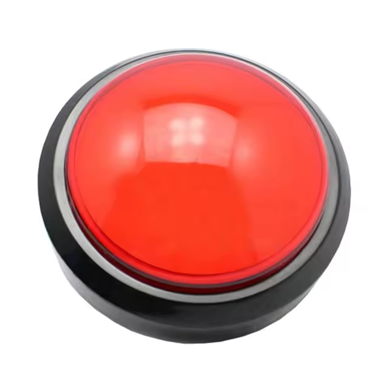
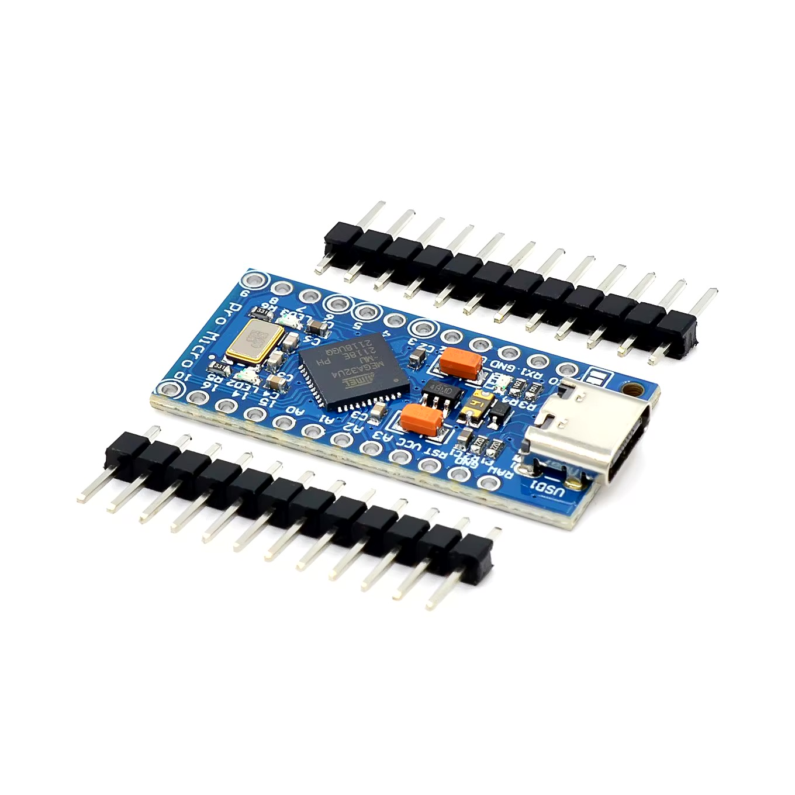

+++
title = "Digital Wheel of Fortune: Fun Gimmick for Tourism Pastoral Events"
description = "A digital wheel of fortune for events of the Tourism Pastoral in the Werdenfels Region and the Tourism Pastoral of the Archdiocese of Munich and Freising."
date = "2024-11-20"
template = "page.html"

[taxonomies]
tags = ["software", "hardware", "work", "html", "css", "javascript", "arduino", "raspberry-pi", "atmega32u4", "n8n", "php"]

[extra]
image = "https://simeon.staneks.de/posts/20241120/images/screenshot.jpeg"
comment =  true
+++

# Genesis

My colleague F. and I came up with something special for the decanal merger of the Werdenfels and Rottenbuch deaneries. It was important to us that the project would make a strong impression. I came up with the idea of a digital wheel of fortune – or fate wheel, as you might call it. It was to be controlled with a foot switch. Depending on the number, participants would receive a postcard personally designed by F. As a highlight, a photo would be taken for selected numbers. A photo booth and a wheel of fortune in one – how hard could it be? 😃

# Concept

## Software

### Frontend

I thought it should be simple to create a wheel of fortune using vanilla web technology. Said and done – within an hour, the principle was established, and the wheel would spin when pressing the 1 key on the keyboard. The design was initially rather makeshift. But F., a passionate layout artist, graphic designer, illustrator, and designer, immediately drew a matching frame for the wheel of fortune and the drawn number.

A test run is possible at [https://tourismuspastoral.de/yourturn/](https://tourismuspastoral.de/yourturn/). Depending on the screen resolution, the frame doesn't fit optimally. Due to time and simplicity constraints, the web app is only optimized for 720p screens – that's completely sufficient.


For numbers 1 and 25, the camera opens and takes a photo after 5 seconds. This function is also triggered when pressing key 2, as we wanted to make the photo available to those photographed. The photo is sent to my server and a QR code is generated to retrieve the photo.


### Backend

Of course, it took some effort to make everything work. The photo is received via an n8n webhook and stored in two locations on my server. Once this process is complete, a confirmation is sent and the corresponding QR code is displayed. Additionally, there is a second webhook.


The QR code leads to a PHP script that allows deleting the photo. The photo can then be removed from both storage locations by the second webhook, if desired.


## Hardware

A laptop would have sufficed for the simple setup, but we wanted to go big: 50-inch screen, foot switch, webcam, and laptop were necessary. The participants visibly had fun.

### Further Development

Our boss was so excited about the action that he wants to set up the wheel of fortune at the leisure fair in Munich. He wishes for a hand switch, and in the course of this, we're also acquiring a Raspberry Pi 5 so that no one has to leave their laptop at the F.re.e for a week.



I bought the switch on AliExpress, along with an Atmega32u4. The chip can act like a keyboard and sends the "1" to the web app when a key is pressed. It can be programmed very easily with the Arduino IDE and can be directly connected to the Raspberry via USB.




### Code Example

Here's the simple code that was uploaded to the Atmega32u4 using the Arduino IDE.

```cpp
#include "Keyboard.h"

// Declaration of pins: 4 for the button and 3 for the LED - both pins must of course be connected to ground
const int buttonPin = 4;
const int ledPin = 3;
int previousButtonState = HIGH;

void setup() {
// Definition of pins
  pinMode(buttonPin, INPUT_PULLUP);
  pinMode(ledPin, OUTPUT);
  Keyboard.begin();
}

void loop() {
// Reads the button state
  int buttonState = digitalRead(buttonPin);
  digitalWrite(ledPin, HIGH);

// When the button is pressed:
  if (buttonState == LOW && previousButtonState == HIGH) {
    Keyboard.print("1");
    // Makes the LED blink 😃
     digitalWrite(ledPin, LOW);
     delay(50);
       digitalWrite(ledPin, HIGH);
    delay(50);
        digitalWrite(ledPin, LOW);
     delay(50);
       digitalWrite(ledPin, HIGH);
    delay(50);
        digitalWrite(ledPin, LOW);
     delay(50);
       digitalWrite(ledPin, HIGH);
    delay(50);
  }

  if (buttonState == HIGH && previousButtonState == LOW) {
// Nothing happens here
    delay(50);
  }
// Stores the current button state
  previousButtonState = buttonState;

}
```

How the final result will ultimately look will become clear in the coming weeks.