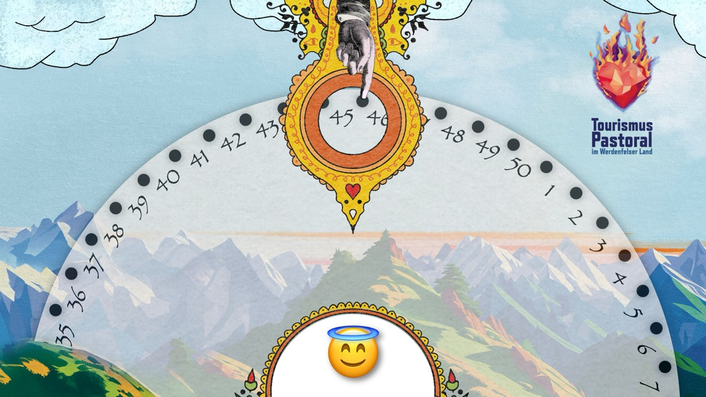
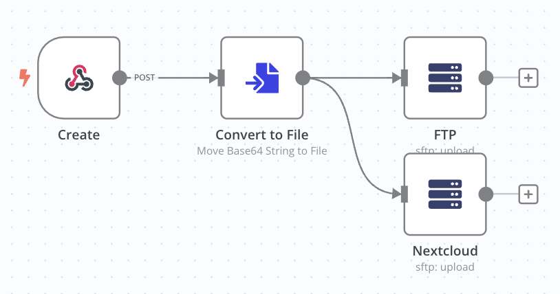
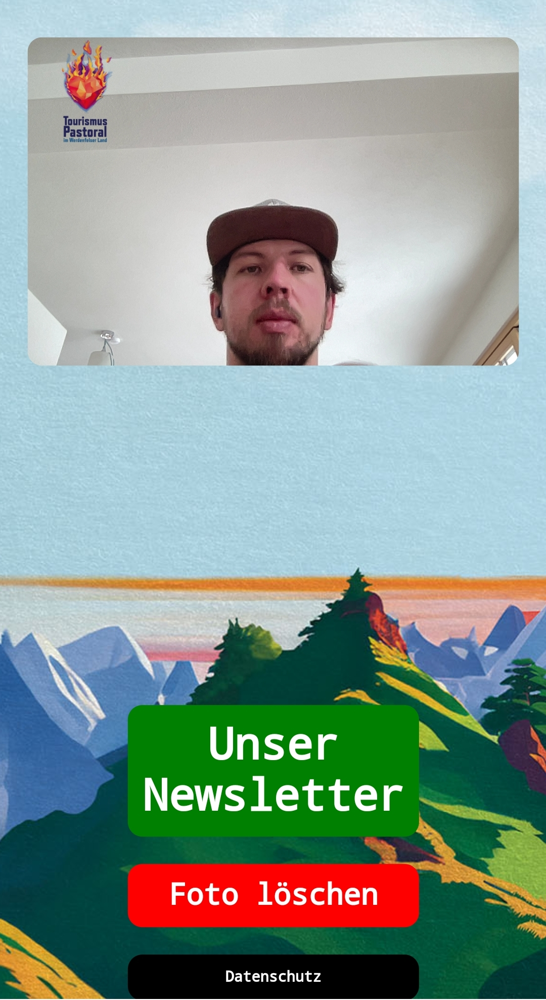
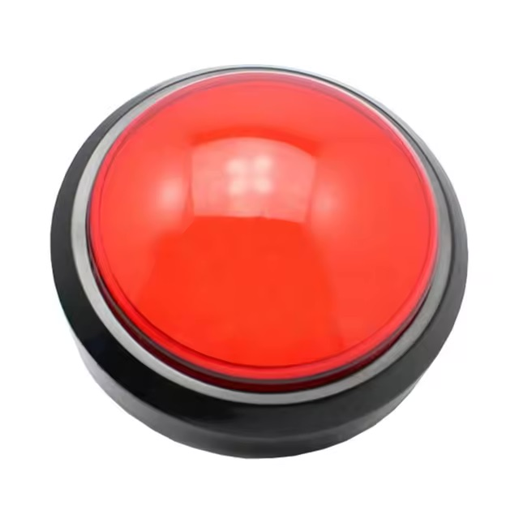
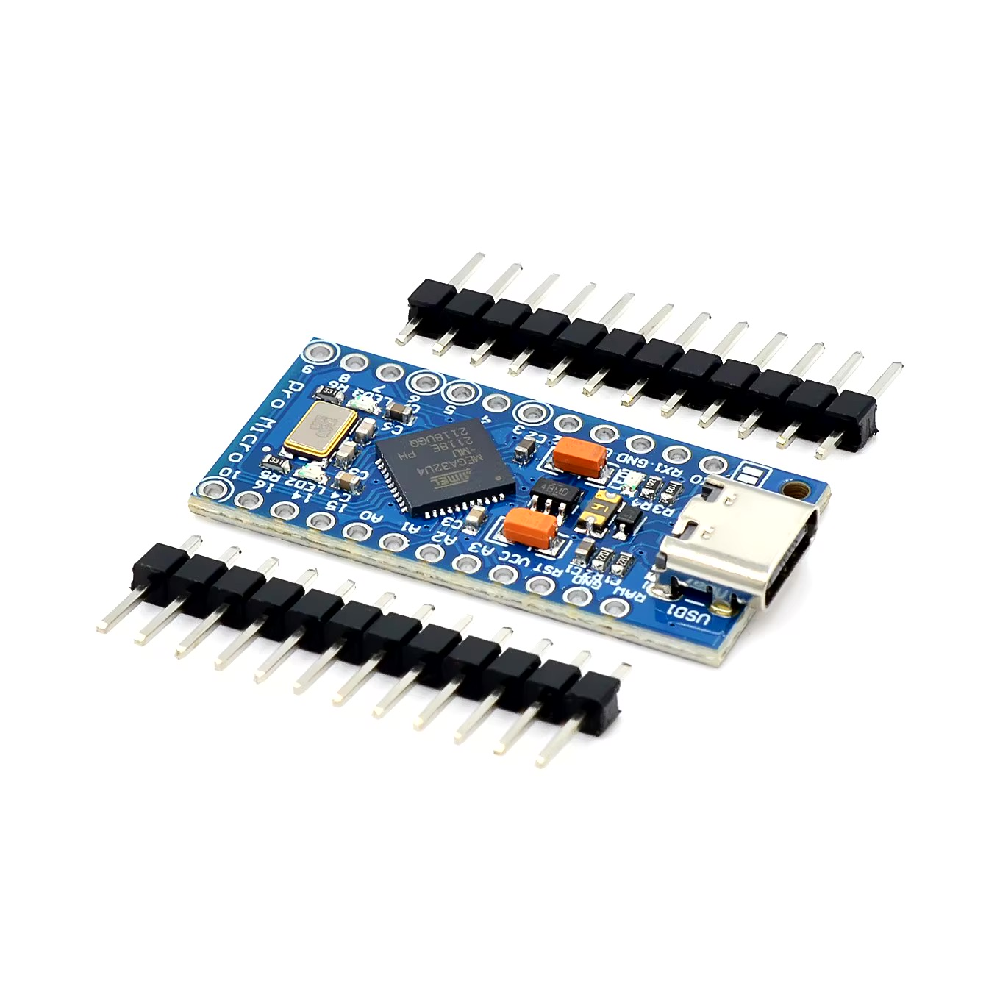

+++
title = "Digitales Glücksrad: Lustiger Firlefanz für die Tourismuspastoral"
description = "Ich stelle dir in diesem Artikel ein digitales Glücksrad vor, das ich für die Veranstaltungen der Tourismuspastoral im Werdenfelser Land und die Tourismuspastoral der Erzdiözese München und Freising entwickelt habe. Wir werden die Idee, die technische Umsetzung und die Nutzung des Glücksrads Schritt für Schritt durchgehen und zeigen, wie es bei verschiedenen Veranstaltungen eingesetzt werden kann. Dieser Leitfaden richtet sich an alle, die nach kreativen und interaktiven Lösungen für ihre Events suchen."
date = "2024-11-20"
template = "page.html"

[taxonomies]
tags = ["software", "hardware", "work", "html", "css", "javascript", "arduino", "raspberry-pi", "atmega32u4", "n8n", "php"]

[extra]
image = "http://simeon.staneks.de/posts/20241120/images/screenshot.jpeg"
comment = true
+++

# Genese

Mein Kollege F. und ich haben uns etwas Besonderes für die Dekanatszusammenlegung der Dekanate Werdenfels und Rottenbuch überlegt. Uns war wichtig, dass das Projekt einen starken Eindruck hinterlässt. So kam ich mit der Idee eines digitalen Glücksrads – oder Schicksalsrads, wie man es auch nennen könnte. Mit einem Fußtaster sollte man es steuern können. Je nach Nummer bekommen die Teilnehmer eine von 10 Postkarten, die persönlich von F. gestaltet wurden. Als Highlight wird bei ausgewählten Nummern ein Foto gemacht. Eine Fotobox und ein Glücksrad in einem – das konnte doch nicht so schwer sein. 😃

# Konzept

## Software

### Frontend

Ich dachte mir, es sollte doch einfach sein, ein Glücksrad mit Vanilla-Webtechnologie zu erstellen. Gesagt, getan – innerhalb einer Stunde stand das Prinzip, und das Rad drehte sich, wenn man auf die Taste 1 auf der Tastatur drückte. Das Design war zunächst eher provisorisch. Doch F., ein leidenschaftlicher Layouter, Grafiker, Zeichner und Designer, zeichnete gleich einen passenden Rahmen für das Glücksrad und die ausgedrehte Nummer.

Ein Probelauf ist möglich unter [https://tourismuspastoral.de/yourturn/](https://tourismuspastoral.de/yourturn/). Je nach Bildschirmauflösung passt der Rahmen nicht optimal. Aus Zeit- und Einfachkeitsgründen ist die Web-App nur für Bildschirme mit 720p optimiert – das reicht völlig aus.



Bei den Nummern 1 und 25 öffnet sich die Kamera und macht nach 5 Sekunden ein Foto. Diese Funktion wird auch beim Drücken der Taste 2 ausgelöst, da wir das Foto den Fotografierten zur Verfügung stellen wollten wird das Foto an meinen Server gesendet und ein QR-Code generiert, mit dem man sich das Foto abholen kann.


### Backend

Natürlich brauchte es einige Bemühungen, damit alles funktioniert. Per n8n-Webhook wird das Foto empfangen und auf meinem Server an zwei Stellen gespeichert. Sobald dieser Vorgang abgeschlossen ist, wird eine Rückmeldung gesendet und der passende QR-Code angezeigt. Zusätzlich gibt es einen zweiten Webhook.



Der QR-Code leitet auf ein PHP-Skript, das es ermöglicht, das Foto zu löschen. Das Foto wird anschließend, wenn gewünscht, durch den zweiten Webhook von beiden Speicherorten entfernt.



## Hardware

Für den einfachen Aufbau würde ein Laptop genügen, aber wir wollten es groß machen: 50-Zoll-Bildschirm, Fußtaster, Webcam und Laptop waren notwendig. Die Teilnehmenden hatten sichtlich Spaß.

### Weiterentwicklung

Unser Chef war von der Aktion so begeistert, dass er das Glücksrad auf der Freizeitmesse in München aufstellen möchte. Er wünscht sich einen Handtaster, und im Zuge dessen schafften wir uns auch einen Raspberry Pi 5 an, damit niemand seinen Laptop eine Woche lang auf der F.re.e lassen muss.



Den Taster habe ich bei AliExpress gekauft, zusammen mit einem Atmega32u4. Der Chip kann wie eine Tastatur agieren und sendet bei Tastendruck die "1" an die Web-App. Er lässt sich sehr einfach mit der Arduino-IDE programmieren und kann direkt per USB an den Raspberry angeschlossen werden.



### Codebeispiel

Hier ist übrigens der einfache Code der per Arduino-IDE auf den Atmega32u4 hochgeladen wurde.

```cpp
#include "Keyboard.h"

// Deklaration der Pins 4 für den Button und 3 für die LED beide Pins müssen natürlich mit einem Ground verbunden werden
const int buttonPin = 4;
const int ledPin = 3;
int previousButtonState = HIGH;

void setup() {
// Definition der Pins
  pinMode(buttonPin, INPUT_PULLUP);
  pinMode(ledPin, OUTPUT);
  Keyboard.begin();
}

void loop() {
// Liest den Buttonstatus
  int buttonState = digitalRead(buttonPin);
  digitalWrite(ledPin, HIGH);

// Wenn der Button gedrückt wurde:
  if (buttonState == LOW && previousButtonState == HIGH) {
    Keyboard.print("1");
    // Blinkt die LED 😃
     digitalWrite(ledPin, LOW);
     delay(50);
       digitalWrite(ledPin, HIGH);
    delay(50);
        digitalWrite(ledPin, LOW);
     delay(50);
       digitalWrite(ledPin, HIGH);
    delay(50);
        digitalWrite(ledPin, LOW);
     delay(50);
       digitalWrite(ledPin, HIGH);
    delay(50);
  }

  if (buttonState == HIGH && previousButtonState == LOW) {
// Hier passiert nichts
    delay(50);
  }
// Speichert den aktuellen Buttonstatus
  previousButtonState = buttonState;

}
```

Wie das Endergebnis schlussendlich aussehen wird, zeigt sich in den nächsten Wochen.
