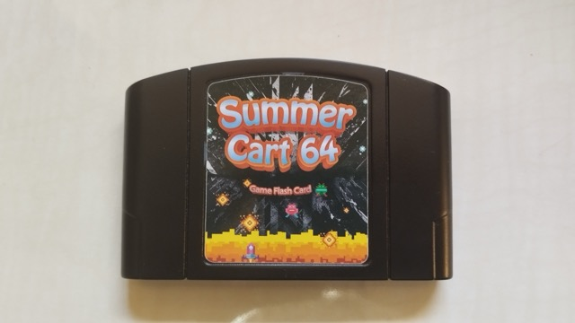
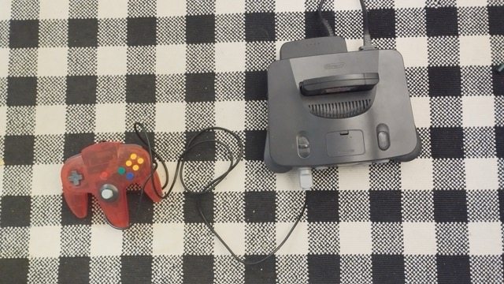

+++
title = "SummerCart64 N64 Flashcart: A Must-Have for N64 Enthusiasts"
date = 2024-11-22
description = "In this article, I will provide you with a comprehensive guide and my personal experiences with the SC64 N64 Flashcart. We will go through the installation, configuration, and daily use of the flashcart step by step and show you how to enjoy your favorite games on original hardware. This guide is aimed at retro gaming enthusiasts looking for a reliable and flexible solution for their N64 games."
[taxonomies]
tags = ["retrogaming", "n64", "hardware", "software", "tutorial", "gaming"]
[extra]
image = "https://simeon.staneks.de/posts/20241122/images/n6400001.jpeg"
comment =  true
+++

# Genesis
I think it was 10 years. In any case, we spent a long time looking for our old N64 console. Just before I was about to buy one on Kleinanzeigen, we found it in a white bag in my parents' basement. There was also a PS2 Slim with it. Nostalgia kicked in. I was so happy with the find and looked forward to gaming.

# SC64 N64 Flashcart: The Modern Way to Enjoy N64 Games

As a long-time Nintendo 64 enthusiast, I was always looking for a reliable way to play my favorite games on original hardware. After some research, I discovered the SC64 Flashcart - and I must say, it was one of the best decisions for my retro gaming setup. Additionally, I bought two new controllers from AliExpress, and I was ready for a new adventure with my N64.

## What is the SC64 - SummerCart64?

The SC64 is a modern flashcart for the Nintendo 64 that allows you to load ROMs from an SD card. Compared to older solutions like the 64drive or EverDrive-64, it offers several modern conveniences such as a USB-C connection and excellent PC integration. Furthermore, the entire project is open source and can be viewed on GitHub [https://github.com/Polprzewodnikowy/SummerCart64/](https://github.com/Polprzewodnikowy/N64FlashcartMenu/blob/main/docs/00_getting_started_sd.md).

## Installation and Initial Setup

The SC64 works like a classic flashcart:
- Format SD card with FAT32 or exFAT
- Copy `sc64menu.n64` to the root directory (The manual mentions creating a `menu` folder, but please don't do that)
- Insert SD card into the SC64
- Insert SC64 into the Nintendo 64
- Power on and wait briefly

Everything should work then. Now the root directory of the SD card has a `menu` folder. You can now simply place the ROMs on the SD card (not in `menu`) and you're ready to go. Everything is described and explained on the [website](https://github.com/Polprzewodnikowy/SummerCart64/blob/main/docs/00_quick_startup_guide.md). Additionally, you can use the SC64Deployer program to flash the SC64's firmware, format the SD card, and upload ROMs.

## Conclusion

After several days of intensive use, I can unconditionally recommend the SC64. The combination of user-friendly operation makes it a perfect companion for N64 enthusiasts.

Advantages:
- Easy installation
- Fast ROM loading times
- Reliable save state management
- Modern USB-C connection
- Active firmware development

Disadvantages:
- Price higher than some alternatives

The SC64 is currently the best N64 flashcart on the market for me. It combines modern technology with nostalgic N64 hardware in a way that will excite both casual gamers and hardware enthusiasts.

For more information and building instructions, visit the official [website](https://summercart64.dev/).