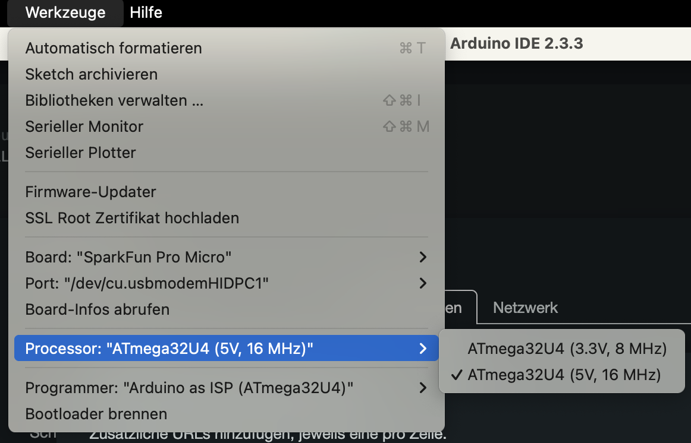

+++
title = "The ATmega32u4 and Arduino IDE: A Revelation with a Touch of Purgatory"
date = 2024-11-24
description = "A practical introduction to the ATmega32u4 microcontroller and its programming using the Arduino IDE"
[taxonomies]
tags = ["software", "hardware", "arduino", "atmega32u4"]
[extra]
image = "https://simeon.staneks.de/posts/20241124/images/foto00001.jpeg"
+++

# Genesis

Back in 2018, I was looking for a way to emulate a keyboard. At the time, I was building a photo booth for my wedding and needed keyboard inputs for a program I had downloaded from GitHub. Today, I find myself facing a similar challenge – this time for a work project. You can find details here: [Digital Wheel of Fortune: Fun Gimmick for Tourism Pastoral Events](https://simeon.staneks.de/en/posts/20241120/).

# Installation and Setup - The Path Through Purgatory

## Arduino IDE

The simplest method for programming the chip is the [Arduino IDE](https://www.arduino.cc/en/software). It can be easily downloaded and installed.

## Configuring the ATmega32u4

After installation, navigate to *Preferences* and add the following link under *Additional Board Manager URLs*:
`https://raw.githubusercontent.com/sparkfun/Arduino_Boards/main/IDE_Board_Manager/package_sparkfun_index.json`

Then, select the appropriate board under *Tools* – in this case, the *Sparkfun Pro Micro*. It's also crucial to select the correct processor based on the operating voltage. The programmer should also match the chip.

{{ note(header="The True Purgatory:  An Important Note!", body="If you select the wrong processor and upload a file, the chip can become non-functional. In this case, the bootloader must be reflashed:

1. Select the correct processor
2. Enter bootloader mode (quickly connect the `RST` & `GND` pins twice in succession)
3. Upload the file within 8 seconds after reset (best to prepare the upload first and then enter bootloader mode)
4. Repeat if error messages occur
5. Successful upload is confirmed with the message `avrdude done. Thank you.`
") }}

After surviving the processor purgatory, the actual programming can begin. The board connects via USB (in my case USB-C) and should be recognized immediately.

## The Revelation: Programming the Chip

For testing, the Blink example under *File > Examples > 01.Basics > Blink* is ideal. Even though this didn't work as expected in my case, the successful upload showed that basic communication with the board was working. For keyboard inputs, you'll need the Keyboard library, which can be installed via *Sketch > Include Library*. You can find a working [code example](https://simeon.staneks.de/en/posts/20241120/#code-example) in the linked article.

# Conclusion

The ATmega32u4 proves to be a true revelation in the world of microcontrollers. Once you've passed through the initial purgatory of configuration, it offers both experienced Arduino developers and beginners an excellent path to microcontroller programming, thanks to its compact size and the extensive collection of examples in the IDE.