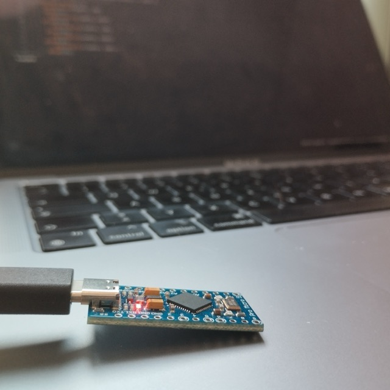
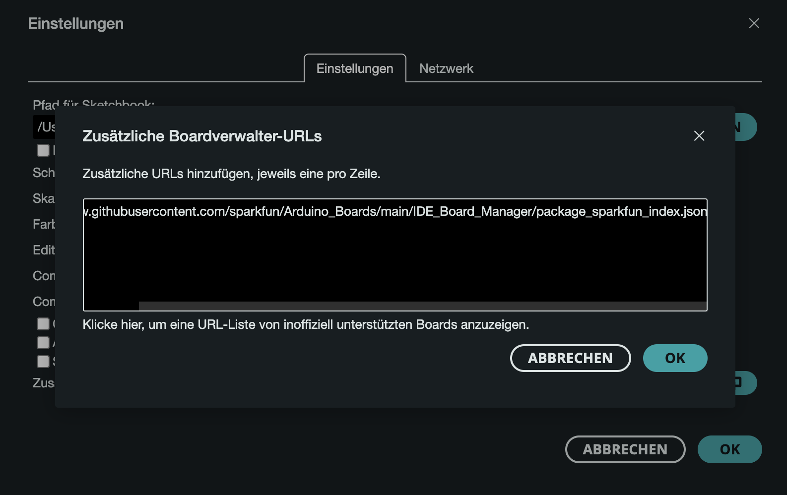
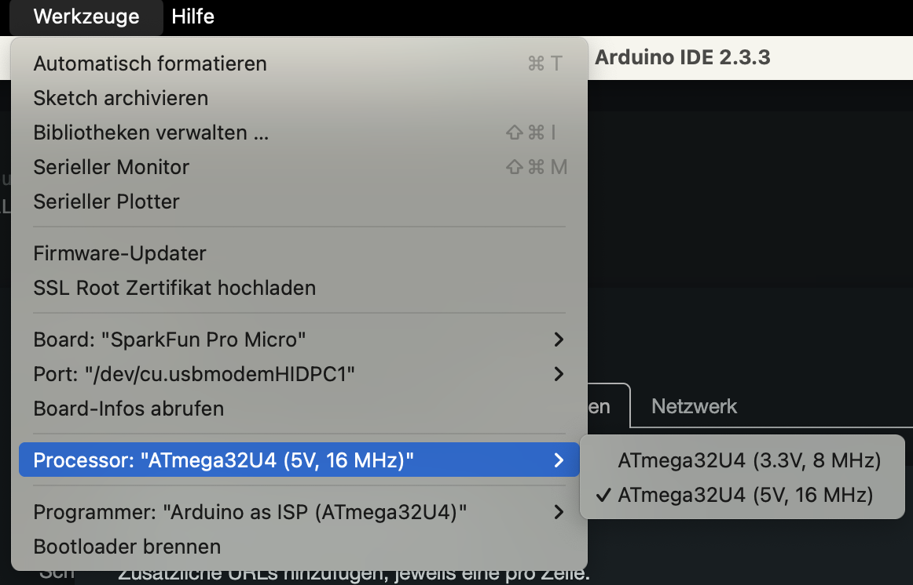

+++
title = "Der ATmega32u4 und die Arduino IDE: Eine Offenbarung mit ein bisschen Fegefeuer"
date = 2024-11-24
description = "In diesem Artikel werde ich Ihnen eine detaillierte Einführung in den ATmega32u4-Mikrocontroller und dessen Programmierung mit der Arduino IDE geben. Wir werden die Installation, Konfiguration und den Einsatz des ATmega32u4 Schritt für Schritt durchgehen und zeigen, wie Sie diesen Mikrocontroller für verschiedene Projekte nutzen können. Dieser Leitfaden richtet sich an Anfänger und Fortgeschrittene, die eine effiziente und flexible Lösung für ihre Mikrocontroller-Projekte suchen."
[taxonomies]
tags = ["software", "hardware", "arduino", "atmega32u4" ,"tutorial"]
[extra]
image = "https://simeon.staneks.de/posts/20241124/images/foto00001.jpeg"
comment =  true
+++

# Genese

Bereits 2018 suchte ich nach einer Möglichkeit, eine Tastatur zu emulieren. Damals baute ich eine Fotobox für meine Hochzeit und benötigte Tastatureingaben für ein von GitHub geladenes Programm. Heute stehe ich vor einer ähnlichen Herausforderung – diesmal für ein Projekt in meiner Arbeit. Details dazu finden sich hier: [Digitales Glücksrad: Lustiger Firlefanz für die Tourismuspastoral](https://simeon.staneks.de/posts/20241120/).

# Installation und Einrichtung - Der Weg durchs Fegefeuer

## Arduino IDE

Die einfachste Methode zur Programmierung des Chips ist die [Arduino IDE](https://www.arduino.cc/en/software). Diese lässt sich unkompliziert herunterladen und installieren.

## ATmega32u4 konfigurieren

Nach der Installation navigiert man zu den *Einstellungen* und fügt unter *Zusätzliche Boardverwalter-URLs* folgenden Link ein:
`https://raw.githubusercontent.com/sparkfun/Arduino_Boards/main/IDE_Board_Manager/package_sparkfun_index.json`

Anschließend wählt man unter *Werkzeuge* das entsprechende Board aus – in diesem Fall den *Sparkfun Pro Micro*. Wichtig ist auch die Auswahl des korrekten Prozessors, abhängig von der Betriebsspannung. Der Programmer sollte ebenfalls zum Chip passen. Das Board wird per USB (in meinem Fall USB-C) angeschlossen und sollte sofort erkannt werden.

{{ note(header="Das wahre Fegefeuer:  Ein wichtiger Hinweis!", body="Bei falscher Prozessorauswahl und anschließendem Upload kann der Chip funktionsunfähig werden. In diesem Fall muss der Bootloader neu geflasht werden:

1. Korrekten Prozessor auswählen
2. Bootloader-Modus aktivieren (2x schnell hintereinander die Pins `RST` & `GND` verbinden)
3. Innerhalb von 8 Sekunden nach dem Reset die Datei hochladen (am besten Upload vorbereiten und dann erst in den Bootloader-Modus wechseln)
4. Bei Fehlermeldungen Vorgang wiederholen
5. Erfolgreicher Upload wird mit der Meldung `avrdude done. Thank you.` bestätigt
") }}

Nach der Bewältigung des Prozessor-Fegefeuers kann die eigentliche Programmierung beginnen.

## Die Offenbarung: Programmierung des Chips

Zum Testen eignet sich das Blink-Beispiel unter *Datei > Beispiele > 01.Basics > Blink*. Auch wenn dieses bei mir nicht wie erwartet funktionierte, zeigte der erfolgreiche Upload, dass die grundlegende Kommunikation mit dem Board funktioniert. Für Tastatureingaben wird zusätzlich die Keyboard-Bibliothek benötigt, die sich über *Sketch > Bibliothek einbinden* installieren lässt. Ein funktionierendes [Codebeispiel](https://simeon.staneks.de/posts/20241120/#codebeispiel) findet sich im verlinkten Artikel.

# Fazit

Der ATmega32u4 erweist sich als wahre Offenbarung in der Welt der Mikrocontroller. Wenn man einmal das anfängliche Fegefeuer der Konfiguration durchschritten hat, bietet er sowohl erfahrenen Arduino-Entwicklern als auch Einsteigern durch seine kompakte Größe und die umfangreiche Beispielsammlung in der IDE einen hervorragenden Weg zur Mikrocontroller-Programmierung.