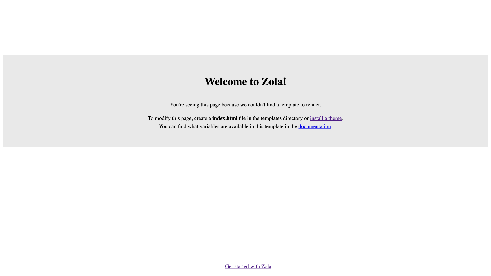
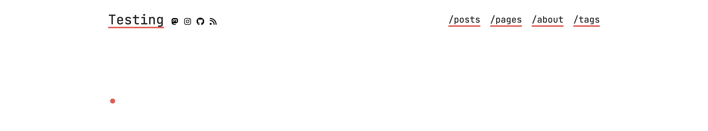

+++
title = "Zola: Der Heilige Gral der Static-Site-Generatoren"
date = 2024-11-25
description = "Eine praktische Einführung in den SSG Zola und Github Pages"
draft = true
[taxonomies]
tags = ["software", "html", "css", "javascript", "zola" ,"github-pages" ,"tutorial","rust"]
[extra]
image = "https://simeon.staneks.de/posts/20241125/images/zola00001.png"
comment =  true
+++

# Genese

Bei unseren wöchentlichen Jogging-Meet ups, reden J. und ich über Gott und die Welt, doch 90% unsere Nerd-Talks handeln von Hosting, Programmierung und jeglichem Technikzeugs, das man sich vorstellen kann. Die Talks sind wahrscheinlich auch der erste Grund fürs Joggen und letztens kam J. auf die grandiose Idee, dass wir doch beide bloggen sollten. Let's do it! Mindestens ein Artikel, einmal im Monat. Da bietet sich doch gleich ein Artikel über den eigenen Blog an. - Denn es gibt so viele Wege zum Blog, wie es Menschen gibt.

# Zola - Ein rostiges Wegstück

Als kleiner Fan der Programmiersprache Rust, bin ich grundsätzlich immer auf der Suche nach Rust-Software. Zola ist ein Static-Site-Generator, der es wirklich in sich hat. Hier ist die Website, der in Entwicklung befindlichen Software: [getzola.org](https://www.getzola.org/)
Wenn man nicht vor CLI-Tools zurückschreckt, dann empfehle ich die Software mal zu testen.
Natürlich gibt es weitere Alternativen, wie [HUGO](https://gohugo.io/), [Next.js](https://nextjs.org/), [Gatsby](https://www.gatsbyjs.com/), [Astro](https://astro.build/), etc. J. hat sich in diesem Fall für Astro entschieden, doch da ich schon gute Erfahrungen mit Zola gemacht habe, entschied ich mich dafür.

## Was macht Zola?

Zola erstellt dir aus statischen Inhalten, aus [Tera-Templates](https://keats.github.io/tera/) und Markdown Dateien eine sog. statische Webseite. Konfiguriert wird alles in einer sog. `config.toml`, die im Wurzelverzeichnis des Projekts bzw. Repositories liegt. Die generierte Webseite findet sich dann im `public` Verzeichnis und kann dann von einem beliebigen Webserver (z.B.[Apache](https://httpd.apache.org/), [Caddy](https://caddyserver.com/), [nginx](https://www.nginx.com/), etc.) bereitgestellt werden. Für mein Projekt nutze ich die Infrastruktur von Gihub Pages, aber dazu später mehr.

## Aufbruch mit Zola

Zola ist einfach zu installieren und zu benutzen, aber auch zu konfigurieren. In diesem Artikel werde ich auf einzelne Schritte eingehen.

### Installation

Es gibt quasi für jedes Betriebssystem eine passende Binärdatei. Auf Gihtub findet man in den meisten Fällen den passenden [Release](https://github.com/getzola/zola/releases), wenn der nicht zu finden ist, dann findet man auch auf [getzola.org](https://www.getzola.org/documentation/getting-started/installation/) Installationsskripte und auch eine Anleitung zum kompilieren von Zola.

### Initialisierung

Wenn Zola installiert ist, kann man mit `zola init` die Verzeichisstruktur eines neuen Projekts erstellen.
Zola frägt dich dann:

```shell
Welcome to Zola!
Please answer a few questions to get started quickly.
Any choices made can be changed by modifying the `config.toml` file later.
> What is the URL of your site? (https://example.com): https://test.staneks.de
> Do you want to enable Sass compilation? [Y/n]: n
> Do you want to enable syntax highlighting? [y/N]: y
> Do you want to build a search index of the content? [y/N]: n

Done! Your site was created in /Users/simeon/zola/testblog.

Get started by moving into the directory and using the built-in server: `zola serve`
Visit https://www.getzola.org for the full documentation.
```

### zola serve

Mit dem Befehl `zola serve` kann man nun die Webseite auf `localhost:1111` einsehen. Bei jeder Änderung passt sich die Seite dann auch an.



### Konfiguration

Die Konfiguartionsdatei `config.toml` liegt im Wurzelverzeichnis des Projekts. Sie ist der Dreh und Angelpunkt für das Projekt. Alle möglichen Konfigurationen finden sich in der [Dokumentation](https://www.getzola.org/documentation/getting-started/configuration/).

Je nach dem empfiehlt dir Zola eine `ìndex.html` datei unter `templates` zu erstellen, bzw. kann man direkt ein theme installieren, das schon Templates und mögliche statische Inhalte beinhaltet. Eine genauere Anletung dazu gibt es unter [Installing & using themes](https://www.getzola.org/documentation/themes/installing-and-using-themes/). Für meinen Blog gehe ich mit dem Theme [Apollo](https://www.getzola.org/themes/apollo/). Diese Theme bringt schon einen Darkmode mit. Man kann sich dann entscheiden ob man die Templates im Theme anpasst, oder weitere im ordner `/templates` hinzufügt.

#### Theme

Nachdem das Theme per git installiert wurde, oder die Daten von einem .zip Archiv in das Verzeichnis `/themes` extrahiert wurden, muss man die `config.toml` Datei dem entsprechend anpassen:

```toml
# Die URL der Webseite
base_url = "https://test.staneks.de"

# Name des Themes, das im Ordner `/themes/apollo` liegt
theme ="apollo"

# Title der Webseite
title = "Testing"

# Bezeichnung der Schlagworte, die den Artikeln zugewiesen werden sollen
taxonomies = [{ name = "tags" }]

# Generiere eine CSS Datei aus sass
compile_sass = false

# Erstelle einen Suchindex
build_search_index = false

#Markdown abhängige Einstellungen
[markdown]

# Erlaube Syntax Highlighting
highlight_code = true

# Theme abhängige Einstellungen
[extra]

# Aktiviere das Darkmode
theme = "auto"

# Social links
socials = [
    { name = "mastodon", url = "https://indieweb.social/@simerl", icon = "mastodon" },
    { name = "instagram", url = "https://www.instagram.com/simeonstanek/", icon = "instagram" },
    { name = "github", url = "https://github.com/SimeonLukas", icon = "github" },
    { name = "rss", url = "/rss.xml", icon = "rss" },
]

# Navigationleiste
menu = [
    { name = "/posts", url = "/posts", weight = 1 },
    { name = "/pages", url = "/pages", weight = 1 },
    { name = "/about", url = "/pages/about", weight = 2 },
    { name = "/tags", url = "/tags", weight = 3 },
]

# Platz für Variablen, die für die ganze Webseite zur Verfügung stehen.
```

Danach schaut die Webseite so aus:


