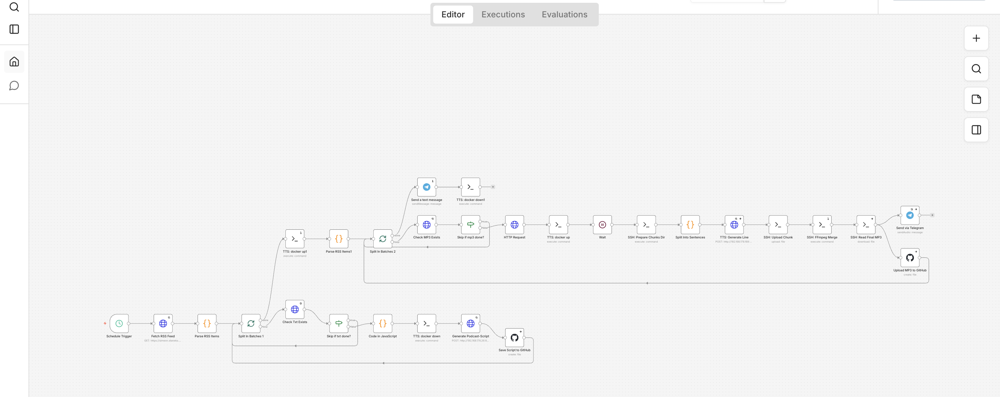

+++
title = "Mein persönlicher KI-generierter Podcast - Lokale KI-Modelle und qwen3-TTS"  
date = 2026-05-31 12:00:00+01:00  
description = "Absurd, was alles lokal mit KI möglich ist. In diesem Beitrag teile ich meine Erfahrungen mit der Erstellung eines KI-generierten Podcasts, der komplett lokal auf meinem Computer läuft, ohne dass eine Internetverbindung erforderlich ist. Ich verwende das qwen3-TTS-Modell von Alibaba und gemma4 von Google, um meine Blogbeiträge in Audio umzuwandeln, und es ist erstaunlich, wie gut die Ergebnisse sind."

[taxonomies]
tags = ["ai", "local-ai", "podcast", "qwen3", "gemma4", "text-to-speech", "TTS", "ai-generated", "locale-ai"]

[extra]
comment =  true
+++

## Genesis: creatio ex nihilo? - Mein LOKAL KI-generierter Podcast

Ok gut. So ein richtiger Podcast ist es nicht. Es handelt sich um einen Monolog, der von einer KI generiert wird, basierend auf den Texten meines Blogs. Eigentlich wäre natürlich so ein richtiger Podcast richtig cool, aber da müssen J. und ich uns mal zusammenraufen. Bis dahin ist jeder Artikel meines Blogs auch als Audio verfügbar (ich nenne es Shortcast - genial, oder?) und über den RSS-Feed abrufbar. Das Ganze wird komplett lokal auf meinem Computer/Server generiert, ohne dass eine Internetverbindung erforderlich ist!

Immer wenn ich jemanden davon erzähle, dass alles lokal läuft, habe ich das Gefühl, dass die Leute denken, dass das dasselbe wie Cloud-Dienste ist. Dann bekomme ich eine Antwort wie: „Ja, also mit NotebookLM kann ich das auch“ oder „ElevenLabs kann das ja auch, oder?“.

Ich habe wirklich das Gefühl, dass der Wert von *local computing* in der Öffentlichkeit total unterschätzt wird. Es ist nicht nur eine Frage der Privatsphäre, sondern auch eine Frage der Kontrolle über die eigenen Daten und der Unabhängigkeit von externen Diensten. Deshalb möchte ich hier auch ein bisschen über die technischen Details sprechen, damit vielleicht der eine oder andere versteht, warum das so cool ist, was heute mit lokaler KI möglich ist.

## Der Aufbau

### Die Hardware

Ihr kennt vielleicht schon meinen Mini-PC mit dem Bazzite drauf. [Hier ist der Artikel dazu.](https://simeon.staneks.de/posts/bazzite-steam-machine-lite/) Dieser Mini-PC hat jetzt CachyOS am Start.  
Mehr habe ich nicht und mehr brauche ich auch nicht, um meine KI-generierten Podcasts zu erstellen. Es ist erstaunlich, wie leistungsfähig diese Hardware ist, wenn man Zeit mitbringt.

Wichtig ist dabei nicht rohe Maximalleistung, sondern dass die gesamte Pipeline stabil und reproduzierbar läuft. Genau das ist bei lokaler KI für mich der große Reiz: Ich kann dieselbe Kette immer wieder ausführen, anpassen und verbessern, ohne auf irgendeinen externen Anbieter angewiesen zu sein.

### Die Software

Für die Textgenerierung nutze ich **Ollama** auf meinem Server mit **Open WebUI** als API. Dort lasse ich aus meinen Blogartikeln zunächst ein Podcast-Skript erzeugen, das in Tonfall und Länge auf eine sinnvolle Audioausgabe optimiert ist. Als Modell setze ich je nach Aufgabe auf **gemma4** beziehungsweise das von mir trainierte bzw. angepasste Modell für die Skriptgenerierung. Das Ganze läuft lokal in meinem Netzwerk und bleibt damit vollständig unter meiner Kontrolle.

Für die Sprachausgabe verwende ich **qwen3-TTS** auf dem Mini-PC. Besonders cool daran: Für den Podcast nutze ich meine eigens geklonte Stimme. Das macht den Output direkt persönlicher und viel näher an dem, was ich selbst als passend empfinde. Es ist schon ein ziemlich merkwürdiges Gefühl, wenn man seine eigenen Texte in der eigenen Stimme hört, aber genau das macht den Effekt auch so stark.

Die eigentliche Orchestrierung läuft über **n8n**. Der Workflow holt sich automatisch die RSS-Feeds meiner Blogposts, prüft, ob zu einem Artikel bereits eine Text- oder Audio-Datei existiert, erstellt dann bei Bedarf das Skript, lässt daraus die Audioausgabe generieren und speichert das Ergebnis wieder in meinem GitHub-Repository. Anschließend wird die fertige MP3-Datei auch noch in den Feed zurückgespielt und optional per Telegram verschickt.

### Der Workflow

Der Workflow ist so aufgebaut, dass er möglichst wenig manuelle Eingriffe braucht. Zuerst wird der RSS-Feed abgefragt, dann die einzelnen Artikel-Links extrahiert und in Batches verarbeitet. Wenn weder `audio.txt` noch `audio.mp3` vorhanden sind, wird der Beitrag weiterverarbeitet; andernfalls wird er übersprungen. Das spart Zeit und verhindert, dass dieselben Artikel unnötig noch einmal gerendert werden.
Anschließend wird aus dem Artikeltext ein Podcast-Skript generiert und in GitHub gespeichert. Danach startet der TTS-Teil: Der Text wird in sprechbare Einheiten aufgeteilt, die Audioausgabe pro Chunk erzeugt und anschließend mit `ffmpeg` wieder zusammengesetzt. Genau diese Chunking-Stufe ist wichtig, weil sehr lange Eingabetexte bei qwen3-TTS sonst schnell unsaubere Ausgaben verursachen können.




```
┌─────────────────────── n8n Workflow: Blog → Podcast ───────────────────────┐
│                                                                              │
│  [Schedule]                                                                  │
│      │                                                                       │
│      ▼                                                                       │
│  [Fetch RSS Feed]                                                            │
│      │                                                                       │
│      ▼                                                                       │
│  [Parse RSS Items]                                                           │
│      │                                                                       │
│      ▼                                                                       │
│  [Split In Batches #1]                                                       │
│      │                                                                       │
│      ├──────────────► [Check TXT exists?] ── yes ──► [Next Article]          │
│      │                         │                                               │
│      │                         no                                              │
│      │                         ▼                                               │
│      │                 [Clean Description]                                     │
│      │                         │                                               │
│      │                         ▼                                               │
│      │              [Generate Podcast Script]                                  │
│      │                         │                                               │
│      │                         ▼                                               │
│      │                [Save Script to GitHub]                                 │
│      │                                                                       │
│      ▼                                                                       │
│  [Split In Batches #2]                                                       │
│      │                                                                       │
│      ├──────────────► [Check MP3 exists?] ── yes ──► [Next Article]          │
│      │                         │                                               │
│      │                         no                                              │
│      │                         ▼                                               │
│      │                    [Start TTS Docker]                                   │
│      │                         │                                               │
│      │                         ▼                                               │
│      │                        [Wait]                                           │
│      │                         │                                               │
│      │                         ▼                                               │
│      │                [Prepare Chunk Folder]                                   │
│      │                         │                                               │
│      │                         ▼                                               │
│      │                 [Split Into Sentences]                                  │
│      │                         │                                               │
│      │                         ▼                                               │
│      │                 [TTS Generate Chunk]                                    │
│      │                         │                                               │
│      │                         ▼                                               │
│      │                  [Upload Chunk via SSH]                                 │
│      │                         │                                               │
│      │                         ▼                                               │
│      │                   [FFmpeg Merge MP3]                                    │
│      │                         │                                               │
│      │                         ├──────────► [Send via Telegram]               │
│      │                         │                                               │
│      │                         └──────────► [Upload MP3 to GitHub]            │
│      │                                                                         │
│      └──────────────────────────────────────────────► [Stop TTS Docker]       │
│                                                                              │
└──────────────────────────────────────────────────────────────────────────────┘
```

### Das Problem mit langen Texten

Bei langen Texten ist mir aufgefallen, dass qwen3-TTS irgendwann komische, fast schon „cronenberg artige“ Sounds erzeugt hat — also eher Geblubber als saubere Sprache. Das Modell kommt offenbar mit zu langen Abschnitten schlechter klar, wenn man alles in einem Rutsch hineinwirft. Deshalb habe ich den Text bewusst in kleinere Teile zerlegt und die Segmente separat generieren lassen.

Das war am Ende die entscheidende Verbesserung. Statt einen großen Block zu synthetisieren, teile ich den Text in natürliche Sprechabschnitte auf, also entlang von Satzenden und in kleine Chunks. Das Ergebnis klingt dadurch deutlich stabiler, natürlicher und vor allem verständlicher. Außerdem lässt sich so viel besser kontrollieren, an welcher Stelle Pause, Tempo oder Betonung kippen.

### Die Ergebnisse
Hier ein von gemma4 generiertes Skript für einen meiner Blogartikel, das als Grundlage für die TTS-Ausgabe dient:

    Ich zeig euch heute mal, wie man Gameboy-Spiele für die Bildungs- und Pastoralarbeit einsetzen kann, um die Motivation beim Lernen so richtig zu steigern. Ich bin ja ein großer Fan von Retrospielen, und vor drei Jahren kam mir die Idee, das Ganze mal mit Gamification in meiner App für die Firmvorbereitung, der feiafanga App, zu kombinieren. Dabei bin ich auf GB Studio gestoßen. Das ist ein tolles, kostenloses Tool, mit dem man ohne Programmierkenntnisse echte Gameboy-Spiele erstellen kann, die sogar auf originaler Hardware laufen. Man kann sie aber auch als HTML fünf exportieren, sodass sie direkt im Browser funktionieren.

    Wenn ihr selbst so ein Spiel bauen wollt, braucht ihr im Grunde ein paar Dinge. Erstens das GB Studio und zweitens Grafiken, also Assets, die man selbst zeichnet oder kostenlos im Netz findet. Dann braucht ihr Musik und einen Emulator, um das Ganze zu testen. Ganz wichtig ist natürlich die Story, die im Bildungskontext einen klaren Bezug zum Thema haben muss. Für die Level-Erstellung empfehle ich euch LDtk, das ist ebenfalls kostenlos und sehr einfach zu bedienen.

    Ich hab das Ganze mal an einem Beispiel umgesetzt. In meinen Spielen geht es um die sieben Gaben des Heiligen Geistes. Die Hauptfigur Eli ist auf dem Weg zur ersten Firmstunde und muss dabei verschiedene Aufgaben lösen. In einer Szene geht es zum Beispiel um die Gabe der Erkenntnis. Eli ist in einer Bibliothek und hilft der Bibliothekarin, die über die Frage nach einem glücklichen Leben nachgrübelt. Am Ende erfährt sie, dass sie auf ihr Herz hören muss. Damit wird deutlich, dass Erkenntnis eben nicht nur Intellekt ist, sondern auch eine spirituelle Dimension hat.

    Zum technischen Ablauf: Ich erstelle die Grafiken, nutze oft Vorlagen von itch.io und passe sie mit Gimp oder Polotno Studio an. In GB Studio baue ich dann die Level und die Logik, was durch Tutorials echt schnell geht. Am Ende exportiere ich das Spiel als Rom-Datei. Damit die Jugendlichen in der App ein Abzeichen bekommen, habe ich ein kleines JavaScript geschrieben. Das Programm beobachtet im Grunde den Videobuffer des Emulators und erkennt an bestimmten Farbcodes, ob das Spiel beendet wurde, um dann das Abzeichen freizuschalten.

    Der große Vorteil bei Gameboy-Spielen ist, dass die einfache Grafik nicht vom Inhalt ablenkt und sie auf fast jedem Gerät laufen. Die Lernenden sind viel aktiver dabei und bauen eine emotionale Bindung zur Geschichte auf. Natürlich war es eine Herausforderung, die Balance zwischen Spielspaß und theologischen Inhalten zu finden, aber es lohnt sich total. Man könnte das Konzept ja auch super auf Bibelgeschichten oder Ethik übertragen. Im Grunde ist diese Mischung aus Nostalgie und moderner Pädagogik ein echt spannender Weg, um Jugendliche heute zu erreichen. Ich hoffe, das gibt euch ein paar gute Impulse für eure eigene Arbeit.

Here ein Beispiel für die Audioausgabe, die ich mit diesem Setup generieren konnte:

<audio style="width: 100%;" controls><source src="https://simeon.staneks.de/posts/gameboy-games-for-education-and-pastoral-work/audio.mp3" type="audio/mpeg"></audio>

### Warum lokal?

Für mich ist das Ganze mehr als nur ein technisches Experiment. Lokal heißt: keine Abhängigkeit von API-Limits, keine laufenden Kosten pro Minute, keine Datenübertragung an fremde Dienste und keine Überraschungen, wenn ein Anbieter plötzlich etwas ändert. Gerade für ein persönliches Projekt wie einen Blog-Podcast ist das Gold wert.

Dazu kommt natürlich der Spaßfaktor. Es ist einfach mega, wenn man merkt, dass man mit relativ überschaubarer Hardware einen kompletten Medien-Workflow bauen kann, der sich nicht verstecken muss. Dass heute so etwas möglich ist, hätte vor ein paar Jahren vermutlich noch wie Science-Fiction geklungen.

## Fazit

Der KI-generierte Podcast ist für mich ein schönes Beispiel dafür, wie weit lokale KI inzwischen gekommen ist. Mit Ollama, Open WebUI, qwen3-TTS, geklonter Stimme und einem n8n-Workflow lässt sich ein kompletter Audio-Workflow auf die Beine stellen, der erstaunlich gut funktioniert. Und obwohl das Ding technisch eher ein „Shortcast“ als ein klassischer Podcast ist, erfüllt es genau seinen Zweck: Es macht meinen Blog hörbar. (Toll, dass man bei Zola auch direkt die Audiodateien in den RSS-Feed einbinden kann!)

Am Ende bleibt für mich vor allem eins hängen: Lokale KI ist nicht nur eine Spielerei, sondern ein echtes Werkzeug. Und wenn man sie klug einsetzt, kann daraus etwas entstehen, das gleichzeitig praktisch, persönlich und richtig unterhaltsam ist.