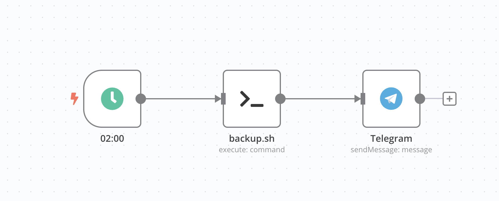

+++
title = "Backup: Affordable and Easy with Hetzner Storagebox and restic"
date = 2025-07-28T22:59:00+01:00
description = "When it comes to backups, you should never wait too long. This article briefly describes how one of my backup solutions works. I use a Hetzner Storagebox and the tool restic to secure my data. The whole thing is simple, affordable, and works reliably."
[taxonomies]
tags = ["programming", "hetzner", "bash", "backup", "tutorial", "restic", "rclone", "n8n", "sftp"]
[extra]
comment = true
+++

## The Genesis: When Data Goes Missing

As a self-hoster and tech enthusiast, you often get yourself into self-made predicaments. Some time ago, I had bought an affordable mini PC that was supposed to serve as a server for my various projects. Maybe I'll create a list of my projects that I host in the near future. Anyway, Windows 11 was pre-installed and I thought I could work well with WSL2 and Docker. Since Backblaze offers a Windows client, I thought the backup problem was solved. But as it happens, things turned out differently. My data like videos and pictures, which were stored on an external hard drive, were gradually uploaded to Backblaze, but somehow and for no reason not completely. One day the hard drive died and I ordered a recovery drive from Backblaze. When the drive arrived, I was very disappointed that only a fraction of my data was recovered. I had a backup, but it was incomplete and I had no idea why.

Long story short: I needed a new backup solution that is easy to use and works reliably. And that's how I came across Hetzner Storagebox and restic.

## The Concept: External Backup at Hetzner, Encrypted with restic

In case your own hardware breaks, the house burns down, or a ransomware attack encrypts your data, it's important to have an external backup. I chose a Hetzner Storagebox because it's affordable and easy to use. At a price of 12.97 euros per month for 5 TB of storage space, it's one of the most affordable solutions on the market and actually comes close to Backblaze's great offer.

### Software and Setup

First of all, you need a Hetzner account. If you don't have one yet, you can sign up [here](https://hetzner.cloud/?ref=znuwnh4Uno3D) and get 20 euros credit as a gift. This is a personal referral link from me.

With the storagebox, you can then decide how you want to access it. I access it via SFTP since I already have experience with it. Username, server address, and password are needed to connect to the Storagebox. I use the tool [rclone](https://rclone.org/) for this, which offers a simple way to integrate an external host into your own system.

With the command `rclone config` you set up the connection. Here, a new remote host is created that points to the Storagebox. The configuration is simple and self-explanatory, as rclone guides you through the process. You just need to enter the access data and select the type of connection (in this case SFTP).

For the backup itself, I use the tool [restic](https://restic.net/), which encrypts your data and backs it up incrementally. It also compresses the data so you need less storage space. This way I compressed my data from 3.62 TB to 2.67 TB.

You probably don't need a separate system for backups, but I created an extra Alpine LXC (Linux Container) that is only responsible for backups. This has the advantage that I can easily rebuild the system if something goes wrong and it runs independently of my other systems. I use Proxmox for this, but that's optional of course.

'rclone' and 'restic' are available for almost all operating systems anyway and can be easily installed.

You can find a more detailed guide for installing and configuring rclone and restic in the [restic documentation](https://restic.readthedocs.io/en/stable/) and the [rclone documentation](https://rclone.org/docs/).

### Backup

Initially, I thought I could write a great script with Claude from Anthropic that would automate my backups. But I ended up doing it myself because the AI overcomplicated the process for me. The following Bash script backs up my data:

```bash
#!/bin/bash

# Simeon's Backup Script for Hetzner

# =============================================================================
# SETTINGS - Adjust here!
# =============================================================================

SOURCE="/mnt/f" # Source directory to be backed up, so the entire 3.62 TB so far.
REMOTE="rclone:Hetzner:backup" # Remote host that points to the Hetzner Storagebox
PASSWORD_FILE="/etc/restic-password" # File with the password for restic
LOG_FILE="/var/log/backup_$(date +%A).log" # Log file for the backup

# =============================================================================

# Check if restic is already running
if pgrep -x "restic" > /dev/null; then
    echo "$(date +%Y-%m-%d\ %H:%M:%S) - A backup is already running." >> "$LOG_FILE"
    echo "A backup is already running."
    exit 1
fi

echo "$(date +%Y-%m-%d\ %H:%M:%S) - Backup starting..." > "$LOG_FILE"
START_TIME=$(date +%s)

# Optimized restic parameters for maximum speed
restic -r "$REMOTE" backup "$SOURCE" \
    --password-file "$PASSWORD_FILE" \
    --tag "backup-$(date +%Y-%m-%d)" \
    --verbose --verbose \
    --pack-size=64 \
    --compression=max \
    --exclude-caches \
    --one-file-system \
    --exclude "node_modules" \
    --exclude ".git" \
    --exclude ".cache" \
    --exclude "tmp" \
    --exclude "logs" \
    --exclude "cache" \
    --exclude "platforms" \
    --exclude "vendor" \
    --exclude ".obsidian" \
    --exclude ".@__thumb" \
    --exclude "*.log" \
    --exclude "*.tmp" \
    --exclude "*~" \
    --exclude ".DS_Store" \
    --exclude "Thumbs.db" \
    --exclude "desktop.ini" \
    --exclude "thumbs" \
    --exclude "Proxmox" \
    >> "$LOG_FILE" 2>&1

# Check if the backup was successful
if [ $? -eq 0 ]; then
    echo "$(date +%Y-%m-%d\ %H:%M:%S) - Backup successful!" >> "$LOG_FILE"
    restic -r "$REMOTE" unlock --password-file "$PASSWORD_FILE" >> "$LOG_FILE" 2>&1
    echo "$(date +%Y-%m-%d\ %H:%M:%S) - Old backups are being cleaned up..." >> "$LOG_FILE"
    restic -r "$REMOTE" forget --keep-last 10 --prune --password-file "$PASSWORD_FILE" >> "$LOG_FILE" 2>&1
    END_TIME=$(date +%s)
    DURATION=$((END_TIME - START_TIME))
    echo "Backup completed in $((DURATION / 60)) minutes and $((DURATION % 60)) seconds."
    echo "$(date +%Y-%m-%d\ %H:%M:%S) - Backup completed in $((DURATION / 60)) minutes and $((DURATION % 60)) seconds." >> "$LOG_FILE"
else
    echo "$(date +%Y-%m-%d\ %H:%M:%S) - Backup failed!"
    exit 1
fi
```

Beforehand, a repository must be created on the Storagebox so that restic knows where to save the data. This is done simply with the command:

```bash
restic init -r "$REMOTE"
```

Additionally, the password for restic must be stored in the file `/etc/restic-password`. This file should of course only be readable by the root user so that no one can access the password without authorization.

### Automation

To automate the backup regularly, I use n8n as I've described in other articles. Of course, this could also be done with cron, but I just like n8n and it gives me a better overview of all workflows. I created a workflow that executes the script once a day at 2 AM. This way I always have a current backup of my data without having to worry about it.



The following command is totally useful and I can recommend it to anyone who wants to automate their backup regularly:

```bash
restic -r "$REMOTE" forget --keep-last 10 --prune --password-file "$PASSWORD_FILE"
```

This keeps the last 10 backups and deletes all older ones. This saves storage space and keeps the backup database organized. The 'prune' command checks the repository and removes data that is no longer referenced and therefore no longer needed. The whole process naturally takes a bit longer because of this, but on a normal day it's only about 5-10 minutes since I only need to back up the new data.

For me, it's also very practical that everything is written to a log file that I can look at anytime. This way I can see if the backup was successful and how long it took. These files are named by day of the week, so I always have the logs from the last week. This is especially useful when I have a problem with the backup and want to check what went wrong.

The nice thing about n8n is also that I get a notification via Telegram after the completed backup. This way I always know if the backup was successful or if there was a problem. This gives me a good feeling that my data is safe.

The following diagram shows the backup process:


flowchart TD
    A["Data<br/>3.62 TB"] --> B["Alpine LXC Container"]
    
    B --> C["rclone SFTP Connection"]
    C --> D["restic Backup"]
    D --> E["Encryption + Compression"]
    
    E --> F["Hetzner Storagebox<br/>5TB / 12.97€"]
    
    F --> G{Backup successful?}
    G -->|Yes| H["Delete old backups<br/>keep-last 10"]
    G -->|No| I["Error Log"]
    
    H --> J["Success Log"]
    J --> L["Telegram: Backup successful"]
    I --> M["Telegram: Backup failed"]
    
    K["Daily 2:00 AM"] --> B
    
    style A fill:#e1f5fe
    style F fill:#c8e6c9
    style E fill:#fff3e0
    style J fill:#e8f5e8
    style I fill:#ffebee
    style L fill:#f3e5f5
    style M fill:#f3e5f5


## Conclusion

With this solution, I found a simple, affordable, and reliable backup solution that safely stores my data. I can recommend anyone who wants to back up their data to use a Hetzner Storagebox and restic. It's easy to set up, cost-effective, and offers high security through encryption. It's also easy to automate the backups and run them regularly. This way I always have a current backup of my data without having to worry about it. And the best part is that I no longer have to worry about my data being lost. I hope this article helps you find a similar solution for your backups.