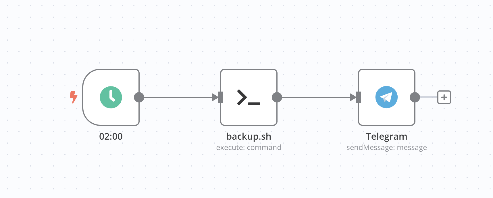

+++
title = "Backup: Günstig und einfach mit Hetzner-Storagebox und restic"
date = 2025-07-28 22:59:00+01:00
description = "Wenn es um Backups geht, sollte man nie zu lang warten. Dieser Artikel beschreibt kurz, wie eine meiner Backuplösungen aussieht. Ich nutze eine Hetzner-Storagebox und das Tool restic, um meine Daten zu sichern. Das Ganze ist einfach, günstig und funktioniert zuverlässig."
[taxonomies]
tags = ["programming", "hetzner", "bash", "backup", "tutorial", "restic", "rclone", "n8n", "sftp"] 
[extra]
comment =  true
+++
# Die Genese: Wenn Daten flöten gehen
Als Selfhoster und Technik-Enthusiast bringt man sich oft gerne in selbstgebaute Zwickmühlen. Vor einiger Zeit hatte ich mir einen günstigen Mini-PC gekauft, der als Server für meine unterschieldichen Projekte dienen sollte. Vielleicht erstelle ich in nächster Zeit eine Liste meiner Projekte, die ich so hoste. Auf jedenfall war Windows 11 vorinstalliert und ich hatte geglaubt, dass ich mit WSL2 und Docker gut arbeiten könnte. Da Backblaze eine Windows Client anbietet, dachte ich, dass damit das Problem Backup gelöst sei. Aber wie es so ist, kam es anders. Meine Daten wie Videos und Bilder, die auf einer externen Festplatte gespeichert waren, wurden zwar nach und nach auf Backblaze hochgeladen, aber irgwnwie und ohne Grund nicht komplett. Eines Tages verabschiedet sich die Festplatte und ich bestellte bei Backblaze eine Wiederherstellungsfestplatte. Als die Festplatte ankam, war ich sehr enttäuscht, dass nur ein Bruchteil meiner Daten wiederhergestellt wurde. Ich hatte zwar eine Sicherung, aber die war unvollständig und ich hatte keine Ahnung warum.

Lange Rede, kurzer Sinn: Ich brauchte eine neue Backup-Lösung, die einfach zu bedienen ist und zuverlässig funktioniert. Und so kam ich auf Hetzner-Storagebox und restic.

## Das Konzept: Externes Backup bei Hetzner, verschlüsselt mit restic
Falls mal die eigene Hardware kaputt geht, die Hütte abbrennt oder ein Ransomware-Angriff die Daten verschlüsselt, ist es wichtig, eine externe Sicherung zu haben. Ich habe mich für eine Hetzner-Storagebox entschieden, weil sie günstig und einfach zu bedienen ist. Mit einem Preis von 12,97 Euro pro Monat für 5 TB Speicherplatz ist es eine der günstigsten Lösungen auf dem Markt und kommt tatsächlich an das tolle Angebot von Backblaze ran.


### Software und Einrichtung
Zu allererst braucht es natürlich einen Hetzner-Account. Wenn du noch keinen hast, kannst du dich [hier](https://hetzner.cloud/?ref=znuwnh4Uno3D) anmelden und bekommst 20 Euro Guthaben geschenkt. Dies ist ein persönlicher Weiterempfehlungslink von mir.

An der storagebox, kann man dann entscheiden, wie man auf sie zugreifen möchte. Ich greife per SFTP zu, da ich damit schon Erfahrung habe. Benutzername, Serveradresse und Passwort werden benötigt, um sich mit der Storagebox zu verbinden. Ich nutze dafür das Tool [rclone](https://rclone.org/), das eine einfache Möglichkeit bietet, einen externen Host in das eigene System einzubinden.

Mit dem Befehl `rclone config` richtet man die Verbindung ein. Hierbei wird ein neuer Remote-Host angelegt, der auf die Storagebox verweist. Die Konfiguration ist einfach und selbsterklärend, da dich rclone durch den Prozess führt. Du musst lediglich die Zugangsdaten eingeben und den Typ der Verbindung auswählen (in diesem Fall SFTP).

Für das Backup selbst nutze ich das Tool [restic](https://restic.net/), das deine Daten verschlüsselt und inkrementell sichert. Außerdem komprimiert es die Daten, sodass du weniger Speicherplatz benötigst. So habe ich meine Daten von 3,62 TB auf 2,67 TB komprimiert.

Warscheinlich braucht es kein eigenes System für die Backups, aber ich habe mir einen extra Alpine LXC (Linux Container) erstellt, der nur für die Backups zuständig ist. Das hat den Vorteil, dass ich das System einfach neu aufsetzen kann, falls mal etwas schiefgeht und er unabhängig von meinen anderen Systemen läuft. Ich nutze dafür Proxmox, aber das ist natürlich optional.

`rclone` und `restic` stehen sowieso für fast alle Betriebssysteme zur Verfügung und können einfach installiert werden.

Eine genauere Anleitung zur Installation und Konfiguration von rclone und restic findest du in der [restic-Dokumentation](https://restic.readthedocs.io/en/stable/) und der [rclone-Dokumentation](https://rclone.org/docs/).

### Backup
Anfangs hatte ich gedacht, dass ich mit Claude von Anthropic bestimmt ein tolles Skript schreiben könnte, das mir die Backups automatisiert. Aber ich habe es dann doch selbst gemacht, da mir die KI denn Prozess zu sehr verkompliziert hat. Folgendes Bash-Skript sichert meine Daten:

```bash
#!/bin/bash

# Simeon's Backup Script für Hetzner

# =============================================================================
# EINSTELLUNGEN - Hier anpassen!
# =============================================================================

SOURCE="/mnt/f" # Quellverzeichnis, das gesichert werden soll, also die gesamten 3,62 TB bis jetzt.
REMOTE="rclone:Hetzner:backup" # Remote-Host, der auf die Hetzner-Storagebox verweist
PASSWORD_FILE="/etc/restic-password" # Datei mit dem Passwort für restic
LOG_FILE="/var/log/backup_$(date +%A).log" # Log-Datei für das Backup

# =============================================================================

# Prüfe ob restic bereits läuft
if pgrep -x "restic" > /dev/null; then
    echo "$(date +%Y-%m-%d\ %H:%M:%S) - Ein Backup läuft bereits." >> "$LOG_FILE"
    echo "Ein Backup läuft bereits."
    exit 1
fi

echo "$(date +%Y-%m-%d\ %H:%M:%S) - Backup startet..." > "$LOG_FILE"
START_TIME=$(date +%s)

# Optimierte restic Parameter für maximale Geschwindigkeit
restic -r "$REMOTE" backup "$SOURCE" \
    --password-file "$PASSWORD_FILE" \
    --tag "backup-$(date +%Y-%m-%d)" \
    --verbose --verbose \
    --pack-size=64 \
    --compression=max \
    --exclude-caches \
    --one-file-system \
    --exclude "node_modules" \
    --exclude ".git" \
    --exclude ".cache" \
    --exclude "tmp" \
    --exclude "logs" \
    --exclude "cache" \
    --exclude "platforms" \
    --exclude "vendor" \
    --exclude ".obsidian" \
    --exclude ".@__thumb" \
    --exclude "*.log" \
    --exclude "*.tmp" \
    --exclude "*~" \
    --exclude ".DS_Store" \
    --exclude "Thumbs.db" \
    --exclude "desktop.ini" \
    --exclude "thumbs" \
    --exclude "Proxmox" \
    >> "$LOG_FILE" 2>&1

# Prüfen, ob das Backup erfolgreich war
if [ $? -eq 0 ]; then
    echo "$(date +%Y-%m-%d\ %H:%M:%S) - Backup erfolgreich!" >> "$LOG_FILE"
    restic -r "$REMOTE" unlock --password-file "$PASSWORD_FILE" >> "$LOG_FILE" 2>&1
    echo "$(date +%Y-%m-%d\ %H:%M:%S) - Alte Backups werden aufgeräumt..." >> "$LOG_FILE"
    restic -r "$REMOTE" forget --keep-last 10 --prune --password-file "$PASSWORD_FILE" >> "$LOG_FILE" 2>&1
    END_TIME=$(date +%s)
    DURATION=$((END_TIME - START_TIME))
    echo "Backup abgeschlossen in $((DURATION / 60)) Minuten und $((DURATION % 60)) Sekunden."
    echo "$(date +%Y-%m-%d\ %H:%M:%S) - Backup abgeschlossen in $((DURATION / 60)) Minuten und $((DURATION % 60)) Sekunden." >> "$LOG_FILE"
else
    echo "$(date +%Y-%m-%d\ %H:%M:%S) - Backup fehlgeschlagen!"
    exit 1
fi
```

Im Vorfeld muss natürlich auf der Storagebox ein Repository angelegt werden, damit restic weiß, wo die Daten gesichert werden sollen. Das geht ganz einfach mit dem Befehl:

```bash
restic init -r "$REMOTE"
```

außerdem muss das Passwort für restic in der Datei `/etc/restic-password` gespeichert werden. Diese Datei sollte natürlich nur für den root-Benutzer lesbar sein, damit niemand unbefugt auf das Passwort zugreifen kann.


### Automatisierung
Um das Backup regelmäßig zu automatisieren, nutze n8n wie ich es schon in anderen Artikel beschrieben habe, natürlich ginge das auch mit cron, aber ich mag n8n einfach und es verschaft mir einen besseren Überblick über alle Workflows. Ich habe einen Workflow erstellt, der das Skript einmal am Tag um 2 Uhr morgens ausführt. So habe ich immer ein aktuelles Backup meiner Daten, ohne dass ich mich darum kümmern muss.



Folgender Befehl ist total sinnvoll und kann ich jedem empfehlen, der sein Backup regelmässig automatisieren will:
```bash
restic -r "$REMOTE" forget --keep-last 10 --prune --password-file "$PASSWORD_FILE"
```
es werden damit die letzten 10 Backups behalten und alle älteren gelöscht. Das spart Speicherplatz und hält die Backup-Datenbank übersichtlich. Der 'prune' Befehl überprüft das Repository und entfernt Daten, die nicht mehr referenziert und daher nicht mehr benötigt werden. Der ganze Prozess dauer natürlich dadurch etwas länger, aber an einem ganz normalen Tag sind es nur so 5 - 10 Minuten, da ich ja nur die neuen Daten sichern muss.

Für mich ist es außerdem sehr praktisch, dass alles in eine Log-Datei geschrieben wird, die ich mir jederzeit anschauen kann. So sehe ich, ob das Backup erfolgreich war und wie lange es gedauert hat. Diese Dateien, werden nach dem Wochentag benannt, sodass ich immer die Logs der letzten Woche habe. Das ist besonders nützlich, wenn ich mal ein Problem mit dem Backup habe und nachsehen möchte, was schiefgelaufen ist.

Das schöne an n8n ist außerdem, dass ich nach dem vollendeten Backup eine Benachrichtigung per Telegram bekomme. So weiß ich immer, ob das Backup erfolgreich war oder ob es ein Problem gab. Das gibt mir ein gutes Gefühl, dass meine Daten sicher sind.
Folgendes Diagramm zeigt den Ablauf des Backups:


flowchart TD
    A["Daten<br/>3.62 TB"] --> B["Alpine LXC Container"]
    
    B --> C["rclone SFTP Verbindung"]
    C --> D["restic Backup"]
    D --> E["Verschlüsselung + Komprimierung"]
    
    E --> F["Hetzner Storagebox<br/>5TB / 12.97€"]
    
    F --> G{Backup erfolgreich?}
    G -->|Ja| H["Alte Backups löschen<br/>keep-last 10"]
    G -->|Nein| I["Fehler-Log"]
    
    H --> J["Success-Log"]
    J --> L["Telegram: Backup erfolgreich"]
    I --> M["Telegram: Backup fehlgeschlagen"]
    
    K["Täglich 2:00 Uhr"] --> B
    
    style A fill:#e1f5fe
    style F fill:#c8e6c9
    style E fill:#fff3e0
    style J fill:#e8f5e8
    style I fill:#ffebee
    style L fill:#f3e5f5
    style M fill:#f3e5f5



## Fazit
Mit dieser Lösung habe ich eine einfache, günstige und zuverlässige Backup-Lösung gefunden, die meine Daten sicher aufbewahrt. Ich kann jedem empfehlen, der seine Daten sichern möchte, eine Hetzner-Storagebox und restic zu nutzen. Es ist einfach einzurichten, kostengünstig und bietet eine hohe Sicherheit durch Verschlüsselung. Außerdem ist es einfach, die Backups zu automatisieren und regelmäßig durchzuführen. So habe ich immer ein aktuelles Backup meiner Daten, ohne dass ich mich darum kümmern muss. Und das Beste ist, dass ich mir keine Sorgen mehr machen muss, dass meine Daten verloren gehen könnten. Ich hoffe, dieser Artikel hilft dir, eine ähnliche Lösung für deine Backups zu finden.