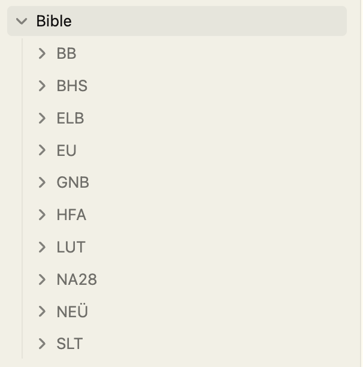
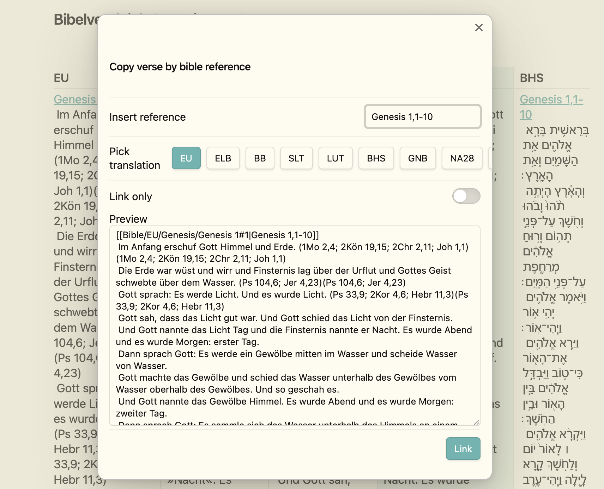
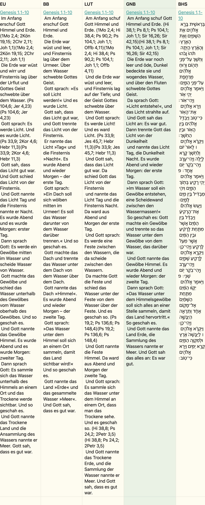

+++
title = "Bible Studies with Bible Crawler, Obsidian and Bible Linker"
date = 2025-01-29
description = "A program I wrote that downloads different Bible versions which can then be used in Obsidian. You can also use and work with the Bible versions as markdown files and convert them to other documents."
[taxonomies]
tags = ["software", "rust", "bible", "obsidian", "tutorial", "bible-linker", "markdown"]
[extra]
comment = true
+++

# Genesis

About three years ago, I wanted to digitize my Bible studies. I wanted to be able to read and compare the Bible in different versions, but unfortunately, it's virtually impossible to obtain Bible texts in digital form in Germany. Most Bible versions are protected by copyright. Fortunately, there are many websites that offer Bible texts in digital form for reading. This gave me the idea to write a program that crawls the Bible texts from these websites and stores them in a format I could use. Since a few issues recently appeared on Github, I decided to improve and expand the program and, of course, write a blog post about it.

## Bible Crawler

I published the small program on [Github](https://github.com/SimeonLukas/Bible-Crawler-Rust) and there are 3 versions: one for Windows, one for Linux, and one for MacOS, so anyone who wants can download the Bible texts in markdown files. Since I had a great interest in the Rust programming language at the time, I wrote the program in Rust. Rust is a modern, performant, and safe programming language that is particularly suitable for system programming. The program is very simple and consists of only one file and the corresponding JSON files that contain the configuration for the Bible versions.

### What does the Bible Crawler do?

The Bible Crawler fetches the HTML from the websites of the various Bible versions (bibleserver.com and die-bibel.de) and extracts the Bible texts. The Bible texts are divided into chapters and verses and stored in a readable format for me. The Bible texts can then be read and edited in a text editor like Obsidian.
The following Bible versions are currently available in the latest version:

```shell
Translations from bibleserver.com:
1. Einheitsübersetzung (EU)    | 2. Luther Bible (LUT)          | 3. Elberfelder Bible (ELB)     | 4. Hope for All (HFA)    
5. Schlachter Bible (SLT)      | 6. La Biblia Textual (BTX)     | 7. Good News Bible 2018 (GNB)   | 8. New Evangelistic Translation (NEUE / NeÜ)
Translations from die-bibel.de:
9. Base Bible (BB)             | 10. Nestle-Aland 28 (NA28)     | 11. Biblia Hebraica Stuttgartensia (BHS)
```

### Installation

You simply need to download and run the [program](https://github.com/SimeonLukas/Bible-Crawler-Rust/releases/latest). There are no other dependencies. The program is very simple.

As a MacOS or Linux user, you only need to make the file executable with `chmod +x ./biblecrawler` so you can run it using `./biblecrawler`.

For MacOS users, you must additionally allow the execution of unsigned programs in the security settings.

### Usage

The program is very easy to use.
After selecting the desired Bible version by number or abbreviation, in the latest version you can choose a naming convention.

```shell
Which naming convention should be used?
1. Uppercase abbreviations (GEN, EXO, LEV, NUM, DEU, etc.)
2. Mixed case abbreviations (Gen, Exo, Lev, Num, Deu, etc.)
3. Typical German Protestant (1. Mose, 2. Mose, 3. Mose, 4. Mose, 5. Mose, etc.)
4. Typical German Catholic (Genesis, Exodus, Levitikus, Numeri, Deuteronomium, etc.)
5. English (Genesis, Exodus, Leviticus, Numbers, Deuteronomy, etc.)
6. Latin (Genesis, Exodus, Leviticus, Numeri, Deuteronomium, etc.)
```

After that, the Bible Crawler will download the Bible texts and save them in markdown files. The files are stored in a folder with the name of the selected Bible version, and the chapters are stored in individual files.
Consequently, the Bible is loaded twice, once with each book in a markdown file and once with each chapter in a markdown file.
The book can be found in the root directory of the Bible version, and the chapters are in a subdirectory with the name of the book.
The files or folders are named according to the selected naming convention, such as `1. Mose` or `Genesis`.
This is very practical for use in Obsidian, as you can link the Bible texts in Obsidian using the Bible-Linker plugin and only need to remember one naming convention.
Thanks to the new update of the Bible Crawler, the Einheitsübersetzung can be downloaded in under a minute depending on your device.

Of course, you can also use and process the files in other programs, but I mainly use them in Obsidian, and the following section shows how to use them effectively in Obsidian.

## Obsidian
The downloaded Bible texts must then be imported into the Obsidian vault. It's best to place the Bible texts in a folder named `Bible` in the root directory of the vault.



### Bible Linker
After installing the Bible Linker plugin from the Community Plugins, the fun can begin. A few settings need to be configured:

Verse offset: -1  
Enable multiple translations: true  
Paths to translations with their names: Bible/NeÜ, Bible/BB, Bible/NA28, Bible/BHS, Bible/EU, Bible/LUT, Bible/ELB, Bible/HFA, Bible/SLT, Bible/BTX, Bible/GNB

Now you can simply link Bible verses in the desired version while writing in Obsidian. The plugin recognizes the Bible verses and links them automatically.





## Conclusion

After continuous development and use, I'm very satisfied with my Bible Crawler. What began as a personal solution for my digital Bible study has become a useful tool that helps others access Bible texts digitally. The combination of the Crawler and Obsidian enables exactly what I originally wanted: to easily read, compare, and incorporate different Bible translations into my studies.
I'm particularly pleased that the downloading is now so fast due to the performance improvements, and the support for different naming conventions makes usage even more flexible. The project shows me how a personal challenge can develop into a practical solution that also provides value for others.