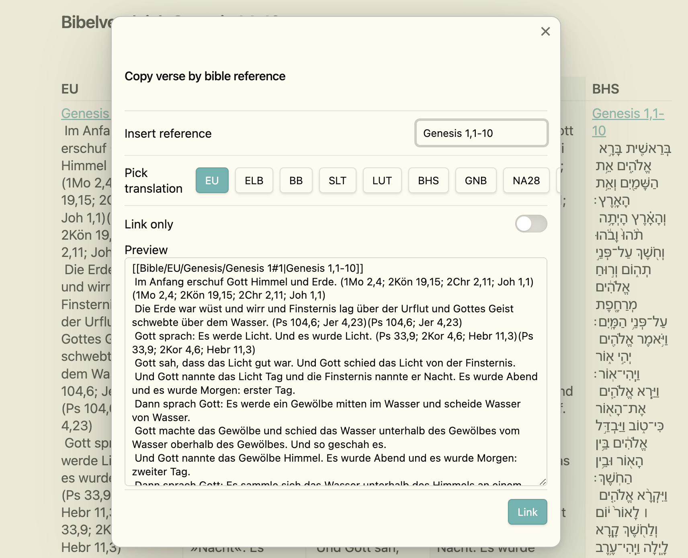

+++
title = "Bibelstudien mit Bible Crawler, Obsidian und Bible Linker"
date = 2025-01-29
description = "Ein von mir geschriebenes Programm, das unterschiedliche Bibelversionen herunterlädt, die man dann in Obsidian nutzen kann. Zudem kann man die Bibelversionen als Markdown-Dateien nutzen und mit Ihnen arbeiten und zu anderen Dokumenten konvertieren."
[taxonomies]
tags = ["software", "rust", "bible", "obsidian", "tutorial","bible-linker", "markdown", "bibel-studien"]
[extra]
comment =  true
+++

# Genese

Vor ca. drei Jahren wollte ich meine Bibelstudien digitalisieren. Ich wollte die Bibel in verschiedenen Versionen lesen und vergleichen können, doch leider ist es in Deutschland geradezu unmöglich, an die Texte der Bibel in digitaler Form zu kommen. Die meisten Bibelversionen sind urheberrechtlich geschützt. Zum Glück gibt es aber eine Menge Webseiten, die die Bibeltexte in digitaler Form lesbar anbieten. So kam ich auf die Idee, ein Programm zu schreiben, das die Bibeltexte von diesen Webseiten "crawled" und in einer für mich nutzbaren Form speichert, da vor kurzem ein paar Issues auf Github aufgetaucht sind, habe ich mich entschieden, das Programm zu verbessern und zu erweitern und natürlich einen Blogpost darüber zu schreiben.

## Bible Crawler

Das kleine Programm habe ich auf [Github](https://github.com/SimeonLukas/Bible-Crawler-Rust) veröffentlicht und es gibt 3 Versionen: eine für Windows, eine für Linux und eine für MacOS, so dass jeder der möchte sich die Bibeltexte in Markdown-Dateien herunterladen kann. Da ich zu der Zeit ein großes Interesse an der Programmiersprache Rust hatte, habe ich das Programm in Rust geschrieben. Rust ist eine moderne, performante und sichere Programmiersprache, die sich besonders für Systemprogrammierung eignet. Das Programm ist sehr einfach gehalten und besteht aus nur einer Datei und den enstprechenden JSON-Dateien, die die Konfiguration für die Bibelversionen enthalten.

### Was macht der Bible Crawler?

Der Bible Crawler fetcht das HTML der Webseiten der verschiedenen Bibelversionen (bibleserver.com und die-bibel.de) und extrahiert die Bibeltexte. Die Bibeltexte werden in Kapitel und Verse unterteilt und in einer für mich lesbaren Form gespeichert. Die Bibeltexte können dann in einem Texteditor wie Obsidian gelesen und bearbeitet werden.
Folgende Bibelversionen stehen aktuell in der neuesten Version zur Verfügung:

```shell
Übersetzungen von bibleserver.com:
1. Einheitsübersetzung (EU)    | 2. Luther Bibel (LUT)          | 3. Elberfelder Bibel (ELB)     | 4. Hoffnung für alle (HFA)    
5. Schlachter Bibel (SLT)      | 6. La Biblia Textual (BTX)     | 7. Gute Nachricht Bibel 2018 (GNB) | 8. Neue Evangelistische Übersetzung (NEUE / NeÜ)
Übersetzungen von die-bibel.de:
9. Basis Bibel (BB)            | 10. Nestle-Aland 28 (NA28)     | 11. Biblia Hebraica Stuttgartensia (BHS)
```

### Installation

Man muss einfach nur das [Programm](https://github.com/SimeonLukas/Bible-Crawler-Rust/releases/latest) herunterladen und ausführen. Es gibt keine weiteren Abhängigkeiten. Das Programm ist sehr einfach gehalten.

Als Nutzer von MacOS oder Linux muss man lediglich die Datei mit `chmod +x ./biblecrawler` ausführbar machen, damit man sie per `./biblecrawler` ausführen kann.

Für MacOS Nutzer muss man zusätzlich in den Sicherheitseinstellungen die Ausführung von nicht signierten Programmen erlauben.


### Nutzung

Das Programm ist sehr einfach zu bedienen.
Nachdem man per Nummer oder Kürzel die gewünschte Bibelversion ausgewählt hat, darf man in der neusten Version sich für eine Namenskonvention entscheiden.

```shell
Welche Namenskonvention soll verwendet werden?
1. Abkürzungen Großbuchstaben (GEN, EXO, LEV, NUM, DEU, etc.)
2. Abkürzungen Groß und Kleinbuchstaben  (Gen, Exo, Lev, Num, Deu, etc.)
3. Deutsch typisch evangelisch (1. Mose, 2. Mose, 3. Mose, 4. Mose, 5. Mose, etc.)
4. Deutsch typisch katholisch (Genesis, Exodus, Levitikus, Numeri, Deuteronomium, etc.)
5. Englisch (Genesis, Exodus, Leviticus, Numbers, Deuteronomy, etc.)
6. Latein (Genesis, Exodus, Leviticus, Numeri, Deuteronomium, etc.)
```

Danach wird der Bible Crawler die Bibeltexte herunterladen und in Markdown-Dateien speichern. Die Dateien werden in einem Ordner mit dem Namen der ausgewählten Bibelversion gespeichert und die Kapitel werden in einzelnen Dateien gespeichert.
Folglich wird die Bibel zweimal geladen, einmal jedes Buch in einer Markdown-Datei und einmal jedes Kapitel in einer Markdown-Datei.
Das Buch findet sich im Wurzelverzeichnis der Bibelversion und die Kapitel in einem Unterordner mit dem Namen des Buches.
Die Dateien bzw. Ordner sind nach der ausgewählten Namenskonvention benannt, wie z.B. `1. Mose` oder `Genesis`.
Das ist für die Nutzung in Obsidian sehr praktisch, da man mit dem Bible-Linker Plugin die Bibeltexte in Obsidian verlinken kann und sich nur eine Namenkonvention merken muss.

Durch das neue Update des Bible Crawlers kann die Einheitsübersetzung je nach Gerät unter einer Minute heruntergeladen werden.

Natürlich kann man die Dateien auch in anderen Programmen nutzen und weiterverarbeiten, doch ich nutze sie hauptsächlich in Obsidian und der folgende Abschnitt zeigt, wie man sie in Obsidian gut nutzen kann.

## Obsidian
Die heruntergeladenen Bibeltexte müssen dann in das Obsidian Vault importiert werden. Am besten legt man die Bibeltexte in einem Ordner namens `Bible` im Wurzelverzeichnis der Vault ab.


### Bible Linker
Nachdem man unter den Community Plugins das Bible Linker Plugin installiert hat, kann der Spaß beginnen. Dabei müssen ein paar Einstellungen vorgenommen werden:

Verse offset: -1  
Enable muliple translations: true  
Paths to translations with their names: Bible/NeÜ, Bible/BB, Bible/NA28, Bible/BHS, Bible/EU, Bible/LUT, Bible/ELB, Bible/HFA, Bible/SLT, Bible/BTX, Bible/GNB

Nun kann man während des Schreibens in Obsidian einfach die Bibelverse in der gewünschten Version verlinken. Das Plugin erkennt die Bibelverse und verlinkt sie automatisch.




## Fazit

Nach stetiger Entwicklung und Nutzung bin ich sehr zufrieden mit meinem Bible Crawler. Was als persönliche Lösung für mein digitales Bibelstudium begann, ist zu einem nützlichen Tool geworden, das auch anderen hilft, Bibeltexte digital zu erschließen. Die Kombination aus dem Crawler und Obsidian ermöglicht mir genau das, was ich ursprünglich wollte: verschiedene Bibelübersetzungen einfach lesen, vergleichen und in meine Studien einbinden zu können.
Besonders freut es mich, dass durch die Performance-Verbesserungen das Herunterladen nun so schnell geht und die Unterstützung verschiedener Namenskonventionen die Nutzung noch flexibler macht. Das Projekt zeigt mir, wie aus einer persönlichen Herausforderung eine praktische Lösung entstehen kann, die auch für andere einen Mehrwert bietet.