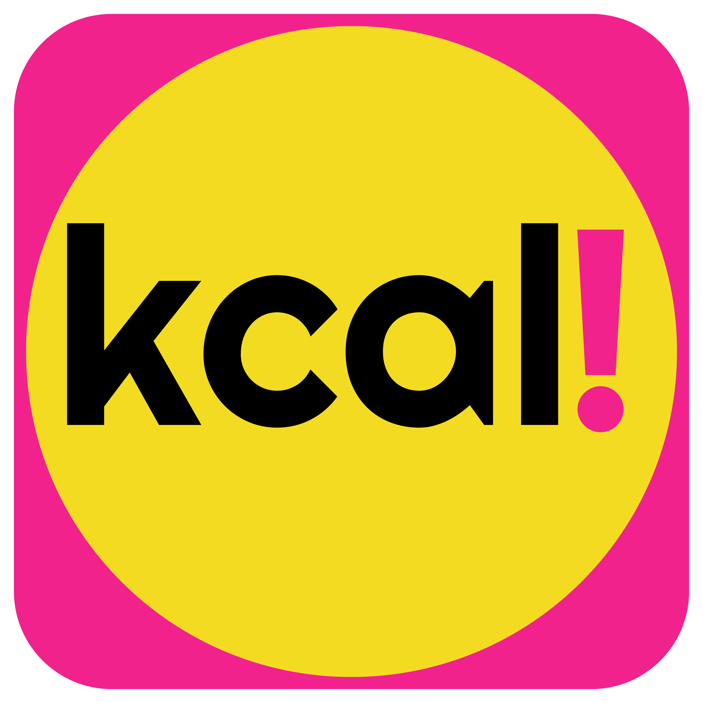

+++
title = " bun run tauri dev - No AI Challenge"
date = 2026-08-31 12:00:00+01:00
description = "Wie ich durch meine saisonale Intressensverschiebung keine Lust auf ein KI Thema habe und deshalb völlig ohne KI meiner neuen Leidenschaft fröhne - Kalorienzählen. Ein kleiner Einblick in Tauri und die Crossplatform Programmierung von einer Kalorientracker App."
[taxonomies]
tags = ["noai", "bun", "tauri", "javascript", "html", "css", "fitness", "kcal!" ,"selfmade"]
[extra]
comment =  true
+++
## Die Genese: Ich habe Lust!
Letztens hatte mir mein Freund M. einen Artikel über das ["Time Magazine"](https://www.heise.de/news/Time-Magazine-schaltet-Werbung-gezielt-fuer-KI-Crawler-11409918.html) geschickt. Es ging tatsächlich um separate Markdown Seiten, die das Magazin an Sprachmodelle ausgibt und sein Kommentar dazu war: "Und immer noch so ein Fan von KI?". Und schwuppdiwupp, so soll heute nicht das Thema KI sein, sondern stupide Produktentwicklung und Programmierung, die wirklich Spaß macht. Und es ist tatsächlich ein kleiner Segen, wenn man sich mal nicht auf KI verlässt, sondern versucht etwas selbst zu machen, sich durchzufuchsen und Probleme per Hand löst. Wer meinem Blog folgt, weiß ja bereits, dass ich eine große Leidenschaft habe. Ich liebe HTML, CSS und Javascript und wenn man es mit Rust verknüpfen kann, dann bin ich wirklich glücklich. Heute fragen wir mal nicht [Claudius Codius](https://enthusiastic.dev/blog/rss-feed-mit-embeddings-modell-sortieren/) lieber [J.](https://enthusiastic.dev/), sondern machen es wie früher: wir Googeln (Duckduckgoen) nach einer Lösung.

### Die Idee
Claude hat mir vor Kurzem einen Kalorien-Telegram-Bot per n8n geschrieben, denn ich jetzt auch schon seit dem 2. Juni verwende und sage und schreibe 5 Kilogramm dadurch verloren habe. Also das Ding funktioniert an sich. Simples Prinzip ich schicke dem Bot die Kalorien, die ich gegessen habe und er sagt mir, wie viel ich für den Tag noch über habe. Mein Ziel ist es täglich unter 3000 kcal zu konsumieren und das hat mich tatsächlich vorangebracht. Zudem mache ich seit 5 Monaten Intervallfasten (Ich starte mit der ersten Mahlzeit um 10:00 und beende die Essensphase um 18:00 Uhr). Das alles hat mir ein besseres Körpergefühl gebracht und ich habe sichtlich abgenommen. Als jetzt nun meine Kumpel M. geschrieben hatte, da hatte er mich auf dem richtigen Fuß erwischt - ich brauche eine clientseitige, offline fähige, selbstgebaute Kalorienzählapp. Nicht weil es so etwas noch nicht gibt, sondern weil ich einfach mal wieder ein Projekt haben möchte, dass nur mir gehört und mit meiner persönlichen Intelligenz erstellt wurde - auch wenn das Ergebnis sicher nicht so geil ist wie eine von Claudius Codius erstellte App.

### Das Werkzeug
- [Tauri](https://tauri.app/) soll es sein. Ich liebe zwar [Cordova](https://cordova.apache.org/), aber seit langem juckt es mich einfach in den Fingern. Schon seit dem ersten Major-Release wollte ich Tauri ausprobieren und damit Apps bauen, nur leider unterstützen sie erst seit Version 2.0 die mobilen Plattformen. Wem Tauri nichts sagt - Tauri ermöglicht es, durch das Ausnutzen des Os' Webviews annähernd native Apps bzw. Programme mit Webtechnologien zu bauen, die damit auch sehr klein sind, weil sie keinen kompletten Browser mitnehmen.
- HTML das kenne ich halt schon.
- CSS ja und das ohne Tailwind, nur die pure Freude am Stylesheet
- JS und das Vanilla (ok darüber lässt sich streiten, aber man kann es halt auch ohne Typen machen, was nicht heißt, dass nicht auf Typen geachtet werden muss. Dafür bine ich dann auch keine fremden Bibliotheken ein bis auf Icons vielleicht.)

### Die Umsetzung
Ja und jetzt sitze ich seit zwei Wochen immer so eine halbe Stunde am Abend da (wenn alles im Haus schläft) und zerbreche mir den Kopf über `EventListener`, `querySelector` und `new Date()`(mein Gott ich hatte vergessen, dass Datum und Zeitangaben so verwirrend in Vanilla Javascript sind). Es ist schon eine Herausforderung, aber es macht so viel Spaß. Wenn ich mal keinen Bock auf CSS habe, dann kümmere ich mich um das DOM und wenn ich keine Lust auf HTML habe, dann kümmere ich mich um das Javascript und dann gibt es ja noch das App Logo bzw. Icon oder die ganze Tauri Umgebung.

#### Das Logo und das Farbschema
Ja wirklich alles darf man selber machen, mein Logo für die tolle App `kcal!` soll ungefähr so aussehen und beinhaltet zugleich die von mir gewählte Schriftart `Righteous`für Header und die Hauptfarben `#F3DB21` und `#F2228D`:


#### Das Layout
Aufgrund der Einfachheit habe ich mich für eine SPA mit Flexlayout entschieden. Hier ein paar Screenshots, der Work-in-Progress-App. Wochentage werden noch mit den jeweiligen Nummern angezeigt. Finde ich schön, dass in der Welt von HTML5 die Woche am Sonntag beginnt:


#### Die Features
- Es sind jetzt schon, dank der offen zugänglichen Daten von [Kalorientabelle](https://www.kalorientabelle.net/) über 2000 deutsche Produkte lokal in der App mit kcal pro 100 g und Standard Portionsgröße in Gramm verfügbar. Hier ein Beispiel:

```json
{
    "name": "Hanuta (Ferrero)",
    "kcal": 542.0,
    "categorie": "Süßigkeiten: Schokolade, Kekse, Bonbons",
    "size": "22"
  }
```

- Man kann ganz einfach seine eigen Produkte einfügen und bestehende Produkte anpassen.
- Kleine Statitsik (Durchschnitt und übrige Kalorien)
- Überblick über die letzten 5 Tage
- Alles offline
- Keine KI Anbindung
- Kein Tracking
- Keine Webung
- Keine blöden Ratschläge zur Ernährung
- **Just kcal!**


### Freud und Leid
Tauri ist tatsächlich richtig cool. Man kann per Hotreload gleich alle Codeänderungen sehen bzw. testen (mit `bun run tauri dev ` läuft quasi immer ein Fenster, dass das Programm ausführt) und ist damit viel schneller im Schreiben des Codes. Das ist bei Cordova nur mit sehr viel Aufwand verbunden.

Der Build für Mac und Android hat instant funktioniert und benötigte keiner Korrekturen.

Tauri bringt schon viele Plugins mit, die die nativen Funktionen des jeweiligen Os' direkt ansprechen. In meinem Fall nutze ich eine `Storage API`, die direkt von Tauri bereitgestellt wird. Im JS wird sie einfach mit `const { load } = window.__TAURI__.store` eingebunden. Bye bye `localStorage` und welcome echter persistenter `key-value Store`.

Ich benutze jetzt schon die App, zwar noch in dieser frühen Alphaphase, aber dank der einfachen Technologien, ´hatte ich bereits nach insgesamt ca. 4 Stunden eine funktionierende Version.

Leider hat Tauri noch keine offizielle Implementierung für das Überschreiben des Back-Buttons bei Android (ich könnte zwar das Kotlin anpassen, aber so ein Feature dürfte schon drin sein), außerdem kann der Android Webview unter Tauri manche HTML-Elemente nicht korrekt rendern, so wird `<progress>` einfach nicht korrekt angezeigt, weshalb ich auf ein `<div>` im `<div>`umgestiegen bin. - Schade!

Man merkt, dass da viel passiert und ich bin wirklich auf die Weiterentwicklung von diesem Framework gespannt. Sobald es geht werde ich mich auch mehr mit der Rust Seite von Tauri auseinandersetzen, aber das erst nach meinem neuen kleinen Projekt. 

## Fazit
Es macht unglaublich viel Spaß! Mehr muss ich dazu eigentlich nicht schreiben. Natürlich ist dieses Projekt jetzt nicht für jeden etwas, aber ich genieße die Vielfalt bei solchen kleinen Dingen und die Möglichkeiten sich kreativ ausleben zu können und wenn ich dabei noch eine für mich neue Technologie kennenlerne, dann ist das der Jackpot. Wie gesagt solche Apps gibt es wie Sand am Meer, aber allein die Selbstwirksamkeit ist der Aufwand wert. Damit mache ich mir persönlich auch deutlich, dass es nicht überall Sprachmodelle braucht und ich nicht zu 100 % davon abhängig bin. Github Link zum Projekt `kcal!` folgt in einem nächsten Artikel. Viel Spaß beim Kalorienzählen.


