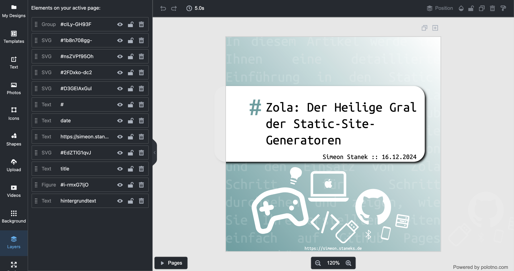

+++
title = "Automatische Cover-Bildgenerierung für Zola-Blogs mit Bun, TypeScript und Polotno"
date = 2025-02-27
description = "Ein Script, das aus den Metadaten von Blogbeiträgen automatisch verschiedene Bilder für verschiedene Plattformen generiert - mit einheitlichem Design, aber individuellen Elementen basierend auf dem Inhalt des jeweiligen Artikels."
[taxonomies]
tags = ["programmierung", "zola", "typescript", "polotno", "bun", "automatisierung", "bloggen", "rss", "bildgenerierung"] 
[extra]
comment =  true
+++
# Die Genese: Warum automatisch Bilder generieren?

Ich liebe Podcasts und höre wirklich viel, deshalb habe ich auf meinem Android Smartphone [Antennapod](https://antennapod.org/) installiert. Wirklich mein lieblings Podcatcher, der dann und wann als Feed-Reader verwendet wird, dabei ist mir aufgefallen, dass ganz einfache RSS-Feeds keine Coverbilder haben, doch für meinen Feed wollte ich das ändern, außerdem brauchte ich sowieso Vorschaubilder für die sozialen Medien. Jeder Blogbeitrag braucht ein ansprechendes Titelbild, um in sozialen Medien, RSS-Feeds und auf der Website selbst Aufmerksamkeit zu erregen. Doch das manuelle Erstellen individueller Bilder für jeden Artikel ist zeitaufwändig und kostet unglaublich viel Überwindung.

Ich habe mich daher entschieden, diesen Prozess zu automatisieren: Ein Script, das aus den Metadaten meiner Blogbeiträge automatisch verschiedene Bilder für verschiedene Plattformen generiert - mit einheitlichem Design, aber individuellen Elementen basierend auf dem Inhalt des jeweiligen Artikels.
<div style="
    text-align: center;
    display: flex;
    overflow: scroll;
    flex-direction: row;
    flex-wrap: nowrap;
    align-items: center;">


</div>

# Die Technik: Zola, Bun, TypeScript und Polotno

## Die technische Lösung im Überblick

Meine Lösung nutzt folgende Technologien:
- **Zola** als statischer Site-Generator für den Blog und in diesem Fall als Server für den RSS-Feed
- **Bun** als JavaScript-Runtime (schneller als Node.js)
- **TypeScript** für die Programmlogik
- **Polotno** zur programmatischen Bildgenerierung
- **RSS-Feeds** als Datenquelle für die Beitragsinformationen

Das System generiert für jeden Blogbeitrag vier verschiedene Bildformate:
1. Ein OG-Image für Social Media Previews
2. Ein Instagram-Format 1
3. Ein Instagram-Format 2
4. Ein Feed-Bild für RSS-Reader

Zusätzlich werden alle Bilder automatisch für verschiedene Sprachversionen des Blogs erstellt.

## Das Deployment-Script

Hier ist das Bash-Script, das den gesamten Prozess startet:

```bash
#!/bin/bash
# Veröffentlichungs-Skript für den Blog
cd /Users/simeonstanek/Apps/BLOG-Homepage/simeonsblog/scripts

# start the server
zola serve --port 1234 &
sleep 5
# run the generator
bun run index.ts

# stop the server
kill $(lsof -t -i:1234)

# commit all changes
cd /Users/simeonstanek/Apps/BLOG-Homepage/simeonsblog
git pull
git add *
git commit -m "update content on $(date)"
git push
```

Dieses Script führt folgende Schritte aus:
1. Wechselt in das Scripts-Verzeichnis
2. Startet den Zola-Server im Hintergrund (für den RSS-Feed)
3. Wartet 5 Sekunden, bis der Server vollständig hochgefahren ist
4. Führt das TypeScript-Script mit Bun aus
5. Stoppt den Zola-Server
6. Checkt Änderungen ein und pusht sie zum Git-Repository

## Der Bildgenerator: Unter der Haube

Nun schauen wir uns den Kern der Lösung an - das TypeScript-Script, das die eigentliche Arbeit erledigt:

```typescript
import { hash } from "bun";
const fs = require("fs");
const { DOMParser } = require("xmldom");
const { createInstance } = require("polotno-node");

// Hauptfunktion, die den gesamten Prozess steuert
async function run(x, lang) {
    let titles = [];
    let dates = [];
    let urls = [];
    let content = [];
    let languages = "de";

    // RSS-Feed abrufen und verarbeiten
    const data = fetch(lang)
        .then((response) => response.text())
        .then((str) => {
            let parser = new DOMParser();
            let xml = parser.parseFromString(str, "text/xml");
            let items = xml.getElementsByTagName("item");
            languages = xml.getElementsByTagName("language")[0].childNodes[0].nodeValue;

            // Informationen aus dem RSS-Feed extrahieren
            for (let o = 0; o < items.length; o++) {
                titles.push(items[o].getElementsByTagName("title")[0].childNodes[0].nodeValue);

                let date = new Date(items[o].getElementsByTagName("pubDate")[0].childNodes[0].nodeValue);
                let options = { year: "numeric", month: "long", day: "numeric" };
                let formattedDate = date.toLocaleDateString("de-DE", options);
                dates.push(formattedDate);

                let url = items[o].getElementsByTagName("link")[0].childNodes[0].nodeValue;
                url = url.split("/");
                url = url[url.length - 3] + "/" + url[url.length - 2];
                urls.push(url);

                let description = items[o].getElementsByTagName("description")[0].childNodes[0].nodeValue;
                if (description.length > 500) {
                    description = description.substring(0, 500) + "...";
                }
                description = description.replace(/<[^>]*>?/gm, "");
                content.push(description);
            }

            // Templates anpassen und Bilder generieren
            for (let k = 0; k < titles.length; k++) {
                let template = JSON.parse(fs.readFileSync("data" + "/" + x, "utf8"));
                for (let i = 0; i < template.pages.length; i++) {
                    template.pages[i].background = "linear-gradient(228deg,white 0%," + getRGB(titles[k]) + " 100%)";
                    for (let j = 0; j < template.pages[i].children.length; j++) {
                        if (template.pages[i].children[j].name == "title") {
                            template.pages[i].children[j].text = titles[k];
                        }
                        if (template.pages[i].children[j].name == "date") {
                            template.pages[i].children[j].text = "Simeon Stanek :: " + dates[k];
                        }
                        if (template.pages[i].children[j].name == "hintergrundtext") {
                            template.pages[i].children[j].text = content[k];
                        }
                    }
                }
                exporter(template, k, urls[k], x, languages);
            }
        });

    // Funktion zur Bildgenerierung und -speicherung
    async function exporter(template, i, url, x, languages) {
        fs.mkdirSync("../content/" + url + "/images/" + languages, { recursive: true });

        if (x == "ogimage.json" && !fs.existsSync("../content/" + url + "/images/" + languages + "/preview.jpg")) {
            let instance = await createInstance({ key: "[your-api-key]" });
            let pdfBase64 = await instance.jsonToImageBase64(template, { mimeType: "image/jpeg" });
            fs.writeFileSync("../content/" + url + "/images/" + languages + "/preview.jpg", pdfBase64, "base64");
            instance.close();
        }
        if (x == "instagram1.json" && !fs.existsSync("../content/" + url + "/images/" + languages + "/instagram1.jpg")) {
            let instance = await createInstance({ key: "[your-api-key]" });
            let pdfBase64 = await instance.jsonToImageBase64(template, { mimeType: "image/jpeg" });
            fs.writeFileSync("../content/" + url + "/images/" + languages + "/instagram1.jpg", pdfBase64, "base64");
            instance.close();
        }
        if (x == "instagram2.json" && !fs.existsSync("../content/" + url + "/images/" + languages + "/instagram2.jpg")) {
            let instance = await createInstance({ key: "[your-api-key]" });
            let pdfBase64 = await instance.jsonToImageBase64(template, { mimeType: "image/jpeg" });
            fs.writeFileSync("../content/" + url + "/images/" + languages + "/instagram2.jpg", pdfBase64, "base64");
            instance.close();
        }
        if (x == "feed.json" && !fs.existsSync("../content/" + url + "/images/" + languages + "/feed.jpg")) {
            let instance = await createInstance({ key: "[your-api-key]" });
            let pdfBase64 = await instance.jsonToImageBase64(template, { mimeType: "image/jpeg" });
            fs.writeFileSync("../content/" + url + "/images/" + languages + "/feed.jpg", pdfBase64, "base64");
            instance.close();
        }
    }
}

// Funktion zur Erzeugung eines RGB-Farbwerts aus einem String
function getRGB(str) {
    let hashed = hash(str);
    let result = hashed.toString(16).substring(0, 6);
    return "#" + result;
}

// Hauptfunktion zur Generierung der Bilder
async function generate() {
    run("ogimage.json", "http://127.0.0.1:1234/rss.xml");

    setTimeout(() => {
        run("instagram1.json", "http://127.0.0.1:1234/rss.xml");
    }, 1000);

    setTimeout(() => {
        run("instagram2.json", "http://127.0.0.1:1234/rss.xml");
    }, 1000);

    setTimeout(() => {
        run("feed.json", "http://127.0.0.1:1234/rss.xml");
    }, 1000);

    setTimeout(() => {
        run("ogimage.json", "http://127.0.0.1:1234/en/rss.xml");
    }, 1000);

    setTimeout(() => {
        run("instagram1.json", "http://127.0.0.1:1234/en/rss.xml");
    }, 1000);

    setTimeout(() => {
        run("instagram2.json", "http://127.0.0.1:1234/en/rss.xml");
    }, 1000);

    setTimeout(() => {
        run("feed.json", "http://127.0.0.1:1234/en/rss.xml");
    }, 1000);
}

generate();
```
## Der Ablauf im Detail

### 1. Daten aus dem RSS-Feed auslesen

Das Script beginnt damit, den RSS-Feed des Blogs zu fetchen und die relevanten Informationen zu extrahieren:
- Titel der Beiträge
- Veröffentlichungsdatum (formatiert)
- URLs der Beiträge
- Kurzbeschreibungen (auf 500 Zeichen gekürzt)

Dabei wird der Feed als XML geparst und die Daten in Arrays gespeichert.

### 2. Individuelle Farbgebung pro Artikel

Eine clevere Funktion des Scripts ist die automatische Farbgenerierung für jeden Artikel:

```typescript
function getRGB(str) {
  let hashed = hash(str);
  let result = hashed.toString(16).substring(0, 6);
  return "#" + result;
}
```

Diese Funktion erzeugt aus dem Titel des Artikels einen Hash-Wert und wandelt diesen in einen HEX-Farbcode um. So erhält jeder Artikel eine einzigartige, aber konsistente Farbgebung, die bei jedem Durchlauf gleich bleibt.

### 3. Template-Anpassung für jeden Artikel

Für jeden Bildtyp (OG-Image, Instagram, Feed) gibt es eine JSON-Vorlage im "data"-Verzeichnis. Diese Vorlagen werden für jeden Artikel dynamisch angepasst. Erstellt habe ich die Templates mit [Polotno Studio](https://studio.polotno.com/):
- Der Hintergrund erhält einen individuellen Farbverlauf
- Der Titel wird eingefügt
- Das Datum mit Autorname wird hinzugefügt
- Ein Ausschnitt des Inhalts wird als Hintergrundtext verwendet
Natürlich sollte man sich vergwissern, dass die Layer im jeweiligen JSON-Template auch so heißen, wie sie im TypeScript-Script angesprochen werden.



### 4. Bildgenerierung mit Polotno

Die angepassten Templates werden mit Polotno in JPEG-Bilder umgewandelt:

```typescript
let instance = await createInstance({
  key:[your-api-key]",
});
// hatte es verpasst die Variabele umzubenennen
let pdfBase64 = await instance.jsonToImageBase64(template, {
  mimeType: "image/jpeg",
});
```

### 5. Speicherung der Bilder in der Blogstruktur

Die generierten Bilder werden in einem strukturierten Verzeichnisbaum gespeichert:
```
/content/[artikelname]/images/[sprache]/[bildtyp].jpg
```

### 6. Mehrsprachige Unterstützung

Das Script generiert automatisch Bilder für alle Sprachversionen des Blogs (im Beispiel Deutsch und Englisch).

## Zola-Konfiguration für die Bildnutzung

Damit Zola die generierten Bilder korrekt nutzen kann, hier ein Beispiel für die entsprechende Template-Konfiguration:

```html
    
    <meta property="og:image" content="{{config.base_url | safe}}{{ page.path | safe }}/images/{{lang}}/preview.jpg" />
    <meta property="og:logo" content="{{config.base_url | safe}}{{ page.path | safe }}/images{{lang}}/preview.jpg" />
    <!-- twitter card -->
    <meta name="twitter:card" content="summary_large_image">
    <meta name="twitter:image" content="{{config.base_url | safe}}{{ page.path | safe }}images/{{lang}}/preview.jpg">
    
    <meta property="og:image" content="{{ config.extra.favicon }}" />
    
```

## Die Vorteile der Automatisierung

Diese Lösung bietet mehrere Vorteile:

1. **Konsistentes Design**: Alle Bilder folgen demselben Design-Schema, was die Markenidentität stärkt (wenn ich eine hätte).
2. **Individueller Touch**: Jeder Artikel erhält trotzdem eine eigene Farbgebung und seinen Inhalt als visuelle Elemente.
3. **Zeiteinsparung**: Die Bildgenerierung erfolgt bevor der Artikel veröffentlicht wird, indem ich nur das Deployment-Script ausführe.
4. **Mehrsprachigkeit**: Alle Sprachversionen werden ohne zusätzlichen Aufwand unterstützt.
5. **Vollständige Integration**: Durch die Git-Integration werden alle Änderungen sofort veröffentlicht.

## Fazit

Mit dieser Kombination aus Zola, Bun, TypeScript und Polotno habe ich eine elegante Lösung gefunden, um den Workflow für meinen Blog zu verbessern. Die automatische Bildgenerierung sorgt dafür, dass jeder Artikel visuell ansprechend präsentiert wird, ohne dass ich dafür zusätzlichen Aufwand betreiben muss.

Die Lösung ist flexibel und kann leicht an andere Anforderungen angepasst werden - sei es durch Änderung der Templates, Hinzufügen weiterer Bildformate oder Anpassung der visuellen Elemente.

Falls du diesen Ansatz für deinen eigenen Blog verwenden möchtest, stelle sicher, dass du einen eigenen Polotno-API-Key erhältst und die Templates an dein eigenes Design anpasst.