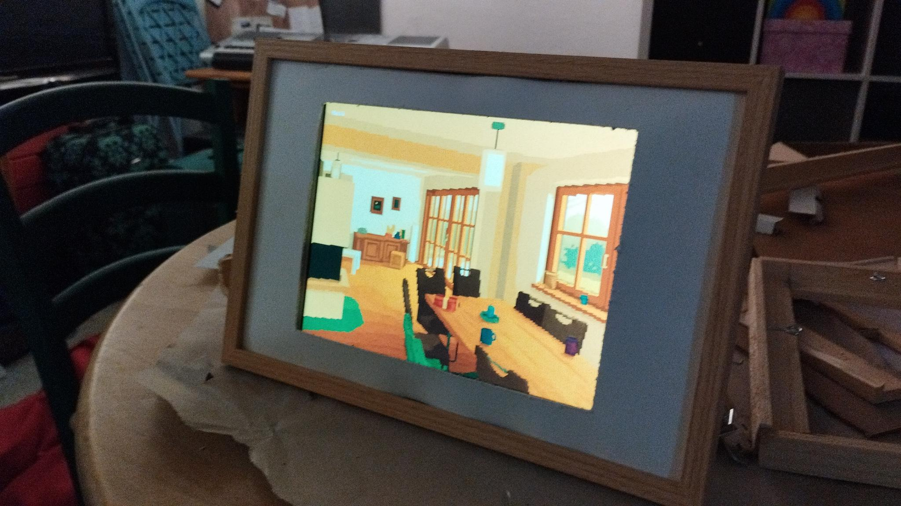

+++
title = "Und schon wieder ein Dashboard: Ipad Air Gen1 - Cheap and Funny"
date = 2025-10-30 12:00:00+01:00
description = "Ja ich weiß, schon wieder ein Dashboard. Aber dieses Mal mit einem iPad Air der ersten Generation. Warum? Weil es günstig ist, Spaß macht und perfekt für mein Smart Home Setup geeignet ist. Im Grunde ist es das Display für mein Dashboard im vorherigen Artikel"
[taxonomies]
tags = ["programming", "javascript", "cordova", "html", "css", "smarthome", "dashboard", "tutorial", "kindle", "software", "ipad"] 
[extra]
comment =  true
+++

# 19€ Smart Home Dashboard mit iPad Air Gen1 - Cheap and Funny
Im Grunde war der Plan, das Dashboard des vorherigen Artikels mit einem Raspberry Pi und einem alten Laptop Display zu realisieren. Aber dann habe ich ein iPad Air der ersten Generation für nur 19€ auf Kleinanzeigen gefunden. Da konnte ich einfach nicht widerstehen. Das iPad Air Gen1 hat einen 9,7 Zoll Retina Bildschirm mit einer Auflösung von 2048 x 1536 Pixeln, was für ein Dashboard absolut ausreichend ist. Außerdem ist es leicht, kompakt und hat eine gute Akkulaufzeit. Viel wichtiger ist jedoch, dass es günstiger ist als ein Raspberry Pi mit Display und es macht einfach Spaß, mit einem iPad zu arbeiten.

## Das Konzept: Cordova App als Dashboard
Anstatt das iPad zu jailbreaken, habe ich mich entschieden, eine Cordova App zu erstellen, die mein Dashboard anzeigt. Cordova ermöglicht es, Webanwendungen in native Apps zu verwandeln und es ist einfach, HTML, CSS und JavaScript zu verwenden, um die Benutzeroberfläche zu gestalten. Die App läuft im Vollbildmodus und bietet eine nahtlose Erfahrung.

Außerdem kann sie unter [Buy me a coffee - Shop](https://buymeacoffee.com/simeonlukas/e/456968) erworben werden, falls jemand Interesse hat. Eine Anleitung zur Verwendung wird automatisch mitgeliefert. Hier eine Kurzanleitung:

### iOS Kiosk App: So installierst du sie auf deinem iPad
#### Was du benötigst

iPad mit iOS 12.5.7 oder höher  
Computer (Windows oder macOS)  
Sideloadly (kostenlos)  
Apple ID (kostenlos)  
iOS Kiosk App-Datei (.ipa)  

#### Installation in 3 Schritten
1. Sideloadly einrichten
Lade Sideloadly von sideloadly.io herunter und installiere die Software auf deinem Computer.
2. iPad verbinden
Verbinde dein iPad per USB-Kabel mit dem Computer und bestätige die Vertrauensanfrage auf dem iPad.
3. App installieren
Öffne Sideloadly, ziehe die .ipa-Datei in das Programmfenster, gib deine Apple ID ein, wähle dein iPad aus und klicke auf "Start Sideloading".
#### Erste Einrichtung
Beim ersten Start der App erscheint automatisch ein Konfigurationsfenster. Gib hier die URL deiner gewünschten Website oder deines Dashboards ein und bestätige mit "OK". Die App startet automatisch im Vollbildmodus ohne sichtbare Statusleiste.
#### Konfiguration anpassen
Nach dem App-Start erscheint für 5 Sekunden ein "Konfiguration"-Button. Tippe darauf, um die angezeigte URL jederzeit zu ändern.
#### Wichtige Hinweise
Zertifikat-Laufzeit: Mit einer kostenlosen Apple ID läuft das App-Zertifikat 7 Tage. Danach musst du die App neu installieren. Ein kostenpflichtiger Apple Developer Account (99€/Jahr) verlängert die Laufzeit auf 1 Jahr.
Optimale Nutzung: Deaktiviere die automatische iPad-Sperre in den Einstellungen und verwende eine stabile WLAN-Verbindung. Für zusätzliche Sicherheit empfiehlt sich die Aktivierung von iOS Guided Access unter Einstellungen > Bedienungshilfen.
#### Fehlerbehebung
Falls die Website nicht lädt, überprüfe die URL auf Tippfehler und die Internetverbindung deines iPads. Bei Problemen hilft meist eine Neuinstallation der App über Sideloadly.

## Fazit

Das iPad Air Gen1 als Smart Home Dashboard ist eine clevere und kostengünstige Alternative zu Raspberry Pi Lösungen. Für gerade einmal 19€ bekommst du ein hochwertiges 9,7 Zoll Retina Display mit exzellenter Auflösung, das sich perfekt für die Dashboard-Visualisierung eignet.

Die Cordova-basierte Kiosk App bietet eine elegante Lösung ohne Jailbreak und lässt sich dank Sideloadly kinderleicht installieren. Der einzige Wermutstropfen ist die 7-Tage-Zertifikatslaufzeit bei kostenloser Apple ID – aber hey, für 19€ kann man auch alle Woche einmal das iPad kurz anstöpseln. (Oder man hat wie ich zum Glück einen kostenpflichtigen Apple Developer Account)

**Vorteile auf einen Blick:**
- Extrem günstiger Einstieg (19€ gebraucht)
- Brillantes Retina Display
- Einfache Installation ohne technische Vorkenntnisse
- Kein Jailbreak notwendig
- Kompakt, leicht und stromsparend

**Nachteile:**
- Wöchentliche Neuinstallation bei kostenloser Apple ID
- Auf Sideloadly angewiesen (keine App Store Lösung)

Für alle, die ein günstiges, schickes Smart Home Display suchen und keine Lust auf Bastelei mit Raspberry Pi haben, ist diese Lösung perfekt. Und mal ehrlich: Es macht einfach mehr Spaß, mit einem iPad zu arbeiten als mit einem zusammengebastelten Display-Setup, dass vielleicht beim Hinschauen schon wieder auseinanderfällt.

