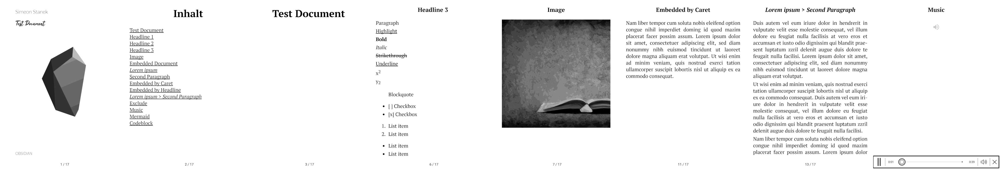

+++
title = "Paperless Work with Obsidian, EPUBs and E-Book Readers"
date = 2025-03-31 22:59:00+01:00
description = "Insights into my paperless workflow with Obsidian, EPUBs and e-book readers. Tips on using Obsidian for notes and creating EPUBs from Markdown files. Introduction to my use of EPUBs and e-book readers for paperless work."
[taxonomies]
tags = ["programmierung", "obsidian", "markdown", "php", "epub", "docker", "software", "typescript", "pocketbook", "ebook-reader", "ebook", "epub-creator", "md2epub"] 
[extra]
comment =  true
+++
# The Genesis: Paperless Work in Pastoral Care

When it comes to note-taking tools, you can dive deep and resurface years later still searching for the perfect solution for your own workflow. I have tried many tools over the last few years to organize my notes and thoughts. I keep returning to [Obsidian](https://obsidian.md) because it offers me the greatest freedom to organize and structure my notes, not to mention the number of plugins it offers. I have established Obsidian as my main note-taking tool to record my thoughts and ideas. I use it for everything I do: from planning projects to documenting ideas to creating church services and sermons. Actually, I am completely happy with the tool, but somehow I have considered it a transitional solution for years, and I believe I am not alone in this.

## Advantages of Using Obsidian

Nevertheless, there are several advantages that I appreciate about Obsidian:
1. **Easy Access**: Through the simple user interface, I can quickly and easily organize and manage my notes.
2. **Markdown**: I can write my notes in Markdown, which gives me the freedom to export them in various formats.
3. **Plugins**: I can use many plugins to enhance and manage my notes. Of course, I can also program plugins for it myself, which makes the tool even more flexible.
4. **Offline Access**: While I synchronize my notes with Nextcloud, I can also use them offline, which gives me the freedom to work anywhere.
5. **Beautiful**: I can customize my notes with various themes and CSS to make them more beautiful. And I love the flexoki theme. It just looks fantastic.

## Practical Workflow: An Example
### The Church Service

In my case, I plan and write my church services and sermons in Obsidian. I have a template for this that I use repeatedly. Because a church service usually consists of the same elements: opening, sign of the cross, welcome, kyrie, prayer of the day, reading, gospel, sermon, intercessions, Our Father, closing prayer, and blessing. I created a template that I can use repeatedly. The template looks like this:

```markdown
# Word Service on {{date:DD.MM.YYYY}}

![[Silence.mp3]]

## Opening

![[{{location}}Music.mp3]]

## Sign of the Cross

In the name of the Father and of the Son and of the Holy Spirit. Amen. +

## Welcome

Dear sisters and brothers, I welcome you all warmly to our word service today {{location}}.

<!-- Insert individual welcome and thematic introduction here -->

## Kyrie

Lord Jesus Christ, you have come to show us the way to the Father. Lord, have mercy on us. You have proclaimed the good news to us and invited us to the kingdom of God. Christ, have mercy on us. You lead us and accompany us into eternal life. Lord, have mercy on us.

![[Music1.mp3]]

## Prayer of the Day

<!-- Insert prayer of the day according to the liturgical day -->

## Reading

<!-- Insert reading according to the liturgical day -->

![[Music2.mp3]]

## Christ Victor... / Hallelujah...

<!-- Depending on the season -->

## Gospel

<!-- Insert gospel according to the liturgical day -->

## Sermon

<!-- Insert sermon - Structure: --> <!-- - Reference to the gospel --> <!-- - Develop main theme --> <!-- - Establish life reference --> <!-- - Formulate hopeful conclusion -->

![[Music3.mp3]]

## Intercessions

Good God, trusting in your love, we bring our requests before you:

1. <!-- Intercession 1 --> _We ask you, hear us._
2. <!-- Intercession 2 --> _We ask you, hear us._
3. <!-- Intercession 3 --> _We ask you, hear us._
4. <!-- Intercession 4 --> _We ask you, hear us._
5. <!-- Intercession 5 --> _We ask you, hear us._
6. <!-- Intercession 6 --> _We ask you, hear us._

God, our Father, you hear our requests. We trust that you are close to us and accompany us with your love. We ask this through Christ, our Lord. Amen.

## Our Father

## Closing Prayer

<!-- Insert appropriate closing prayer -->

## Blessing

May the God of light and life bless you with the light of his presence, which dispels the night and illuminates the darkness.

May the Creator of all things fill your heart with the vastness of the sky and the firmness of the ground beneath your feet.

<!-- Adapt third part of the blessing according to the theme -->

And so may Almighty God bless you, the Father, the Son, and the Holy Spirit. Amen.

## Closing Song

![[ClosingSong.mp3]]
```
Most people probably don't use Obsidian for church service preparation, but I actually find that it's a very good use case for Obsidian.

Once the church service is created, you would normally print it out and take it with you. But I thought I could do this differently too. I bought an e-book reader to keep my church services and sermons paperless. I just wanted to try out how it would be. And I have to say, it's really a great thing. I can read my church services and sermons on the e-book reader and don't have to print them out anymore. This saves paper and is much more practical. And if you've been paying attention, you'll also find links to the music files that I include in the church service in the template. This is really practical because I can play the music directly on the e-book reader and don't have to switch between different devices anymore. Thanks to the .epub format, I can insert the music files directly into the sequence. Another added value is, of course, the better readability on the e-book reader. I can adjust the font size, contrast, and brightness individually. I can read my texts even in complete darkness. This is really great.

### The Export
Unfortunately, there was no plugin for Obsidian for this, so I wrote my own 3 years ago: [obsidian-kindle-export](https://github.com/SimeonLukas/obsidian-kindle-export). At that time, I still owned a Kindle, hence the name. The plugin exports the Markdown files to an .epub format, which is then sent by email to the Kindle. The plugin can simply be searched for in the community plugins and installed. The plugin is very easy to use, and I can recommend it to anyone who wants to read their notes on their e-book reader. In the settings, you simply enter the necessary data, and the plugin does the work. You can start the conversion with the command `Kindle: Export`. I've mapped the command to the keys `cmd+0` so it can be executed quickly and easily.


Unfortunately, it is not possible to send an email from within Obsidian, so there is another program that takes over this function. [Md2epub](https://md2epub.staneks.de/) is a server written in PHP that receives the files from Obsidian and then sends them. My hosted version can certainly be used, but I recommend running the program yourself. For this, there is a Docker container that can be found [here](https://hub.docker.com/r/simeonstanek/md2epub).

By the way, the following image shows an EPUB I created, though the cover has changed since then.




### Hardware

I've been using the Pocketbook Era for two years now, which supports playing audio files within the .epub format, and I can also connect any Bluetooth speaker to it. In my case, the Teufelbox Rockster Cross. I'm completely satisfied with that. The Pocketbook is a very good e-book reader, and I can recommend it to anyone looking for an e-book reader. It is certainly slower than a Kindle, but the added value with audio playback convinced me.

## Conclusion: The Digital Transformation of Pastoral Work
What began as a search for the optimal note-taking tool has developed into a comprehensive digital workflow for pastoral work. Obsidian has proven to be an ideal platform, convincing through its flexibility, Markdown support, and extensibility. The combination with an e-book reader like the Pocketbook Era creates a consistently digital solution that is not only paperless but also opens up new possibilities.
The integration of audio files directly into the church service sequence, the improved readability through individually adjustable font, and the ability to work in any lighting situation are tangible advantages over conventional paper, even if one likes the haptics (especially in church 😇). Through self-developed tools like the obsidian-kindle-export plugin, this bridge between preparation and execution is seamlessly built.
Ultimately, it's not just about digitization for its own sake. It's about making pastoral work more efficient, flexible, and sustainable. The time that was previously spent on printing, sorting, and transporting paper can now be used for content work. And while some may hesitate to switch to digital solutions, this workflow shows that technology and spirituality are not mutually exclusive but can complement each other beneficially.

Amen😘