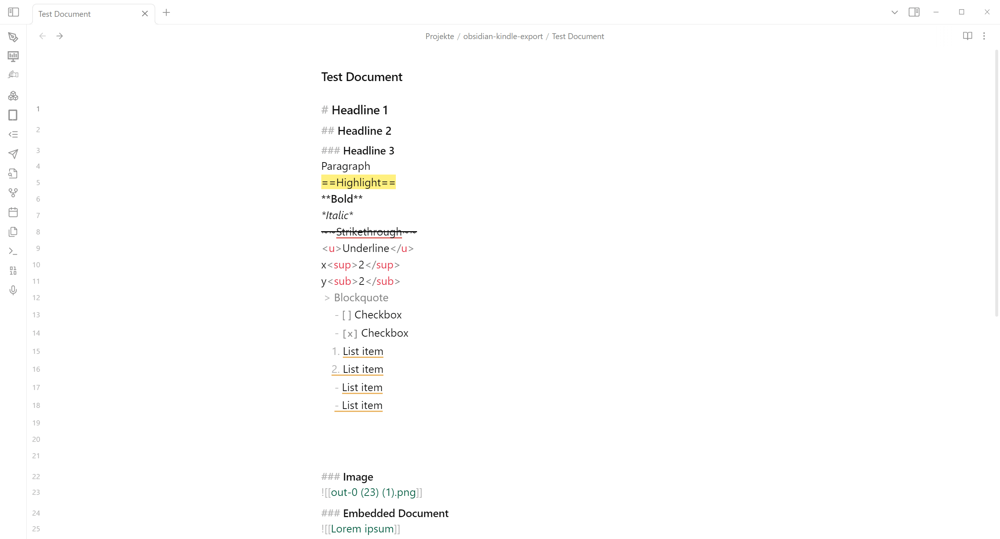
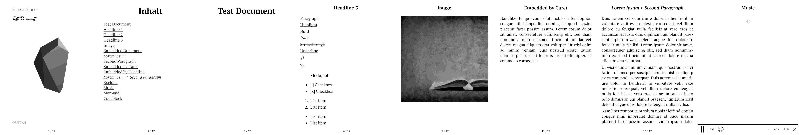

+++
title = "Papierloses Arbeiten mit Obsidian, Epubs und Ebook-Reader"
date = 2025-03-31 22:59:00+01:00
description = "Einblicke in meinen papierlosen Workflow mit Obsidian, Epubs und Ebook-Readern. Tipps zur Nutzung von Obsidian für Notizen und das Erstellen von Epubs aus Markdown-Dateien. Vorstellung meiner Nutzung von Epubs und Ebook-Readern für das papierlose Arbeiten."
[taxonomies]
tags = ["programmierung", "obsidian", "markdown", "php", "epub", "docker", "software", "typescript", "pocketbook", "ebook-reader", "ebook", "epub-creator", "md2epub"] 
[extra]
comment =  true
+++
# Die Genese: Papierloses Arbeiten in der Pastoral

Wenn es um Notiz-Tools geht, dann kann man da tief abtauchen und nach Jahren auftauchen und ist immer noch auf der Suche nach einer perfekten Lösung für den eigenen Workflow. Ich habe in den letzten Jahren viele Tools ausprobiert, um meine Notizen und Gedanken zu organisieren. Immer wieder kehre ich zu [Obsidian](https://obsidian.md) zurück, da es mir die größte Freiheit bietet, meine Notizen zu organisieren und zu strukturieren, geschweige der Menge an Plugins, die es bietet. Ich habe Obsidian als mein Haupt-Notiz-Tool etabliert, um meine Gedanken und Ideen festzuhalten. Ich nutze es für alles, was ich so mache: von der Planung von Projekten über die Dokumentation von Ideen bis hin zur Erstellung von Gottesdiensten und Predigten. Eigentlich bin ich vollkommen glücklich mit dem Tool, aber irgendwie betrachte ich es seit Jahren als Übergangslösung und ich glaube da bin ich nicht alleine.

## Vorteile der Nutzung von Obsidian

Nicht destotrotz gibt es einige Vorteile, die ich an Obsidian schätze:
1. **Einfacher Zugang**: Durch die einfache Benutzeroberfläche kann ich schnell und einfach meine Notizen organisieren und verwalten.
2. **Markdown**: Ich kann meine Notizen in Markdown schreiben, was mir die Freiheit gibt, sie in verschiedenen Formaten zu exportieren.
3. **Plugins**: Ich kann viele Plugins verwenden, um meine Notizen zu verbessern und zu verwalten. Natürlich kann ich auch selbst Plugins dafür programmieren, was das Tool noch flexibler macht.
4. **Offline-Zugriff**: Ich synchronisiere meine Notizen zwar mit Nextcloud, aber ich kann sie auch offline nutzen, was mir die Freiheit gibt, überall zu arbeiten.
5. **Wunderschön**: Ich kann meine Notizen mit verschiedenen Themes und CSS anpassen, um sie schöner zu gestalten. Und ich liebe das flexoki Theme. Es sieht einfach fantastisch aus.

## Praktischer Workflow: Ein Beispiel
### Der Gottesdienst

In meinem Fall ist es so, dass ich meine Gottesdienste und Predigten in Obsidian plane und schreibe. Ich habe dafür ein Template, das ich immer wieder verwende. Denn ein Gottesdienst besteht ja meistens aus den gleichen Elementen: Eröffnung, Kreuzzeichen, Begrüßung, Kyrie, Tagesgebet, Lesung, Evangelium, Predigt, Fürbitten, Vater unser, Schlussgebet und Segen. Ich habe mir ein Template erstellt, das ich immer wieder verwenden kann. Das Template sieht so aus:

```markdown
# Wortgottesfeier am {{date:DD.MM.YYYY}}

![[Stille.mp3]]

## Eröffnung

![[{{location}}Musik.mp3]]

## Kreuzzeichen

Im Namen des Vaters und des Sohnes und des Heiligen Geistes. Amen. +

## Begrüßung

Liebe Schwestern und Brüder, ich begrüße Sie alle herzlich zu unserer heutigen Wortgottesfeier {{location}}.

<!-- Hier individuelle Begrüßung und thematische Einführung einfügen -->

## Kyrie

Herr Jesus Christus, du bist gekommen, um uns den Weg zum Vater zu zeigen. Herr, erbarme dich unser. Du hast uns die frohe Botschaft verkündet und uns zum Reich Gottes eingeladen. Christus, erbarme dich unser. Du führst uns und begleitest uns in das ewige Leben. Herr, erbarme dich unser.

![[Musik1.mp3]]

## Tagesgebet

<!-- Tagesgebet entsprechend dem liturgischen Tag einfügen -->

## Lesung

<!-- Lesung entsprechend dem liturgischen Tag einfügen -->

![[Musik2.mp3]]

## Christus Sieger... / Halleluja...

<!-- Je nach Jahreszeit -->

## Evangelium

<!-- Evangelium entsprechend dem liturgischen Tag einfügen -->

## Predigt

<!-- Predigt einfügen - Gliederung: --> <!-- - Bezug zum Evangelium --> <!-- - Hauptthema entfalten --> <!-- - Lebensbezug herstellen --> <!-- - Hoffnungsvollen Abschluss formulieren -->

![[Musik3.mp3]]

## Fürbitten

Guter Gott, in Vertrauen auf deine Liebe bringen wir unsere Bitten vor dich:

1. <!-- Fürbitte 1 --> _Wir bitten dich, erhöre uns._
2. <!-- Fürbitte 2 --> _Wir bitten dich, erhöre uns._
3. <!-- Fürbitte 3 --> _Wir bitten dich, erhöre uns._
4. <!-- Fürbitte 4 --> _Wir bitten dich, erhöre uns._
5. <!-- Fürbitte 5 --> _Wir bitten dich, erhöre uns._
6. <!-- Fürbitte 6 --> _Wir bitten dich, erhöre uns._

Gott, unser Vater, du hörst unsere Bitten. Wir vertrauen darauf, dass du uns nahe bist und uns mit deiner Liebe begleitest. Darum bitten wir durch Christus, unseren Herrn. Amen.

## Vater unser

## Schlussgebet

<!-- Passendes Schlussgebet einfügen -->

## Segen

Der Gott des Lichts und des Lebens segne euch mit dem Licht seiner Gegenwart, das die Nacht vertreibt und die Dunkelheit erhellt.

Der Schöpfer aller Dinge erfülle euer Herz mit der Weite des Himmels und der Festigkeit des Bodens unter euren Füßen.

<!-- Dritten Segensteil entsprechend dem Thema anpassen -->

Und so segne euch der allmächtige Gott, der Vater, der Sohn und der Heilige Geist. Amen.

## Schlusslied

![[Schlusslied.mp3]]
```
Die wenigsten nutzen wahrscheinlich Obsidian zur Gottesdienstvorbereitung, aber ich finde tatsächlich, dass das ein sehr guter use-case für Obsidian ist.

Wenn der Gottesdienst dann erstellt ist, dann würde man ihn normalerweise ausdrucken und mitnehmen. Aber ich habe mir gedacht, dass ich das auch anders machen kann. Ich habe mir einen Ebook-Reader gekauft, um meine Gottesdienste und Predigten papierlos zu halten. Ich wollte einfach mal ausprobieren, wie das so ist. Und ich muss sagen, es ist wirklich eine tolle Sache. Ich kann meine Gottesdienste und Predigten auf dem Ebook-Reader lesen und muss sie nicht mehr ausdrucken. Das spart Papier und ist viel praktischer. Und wenn du aufgepasst hast, findest du in dem Template auch schon die Links zu den Musikdateien, die ich in den Gottesdienst einfüge. Das ist wirklich praktisch, denn ich kann die Musik direkt auf dem Ebook-Reader abspielen und muss nicht mehr zwischen verschiedenen Geräten wechseln. Dank des .epub-Formats kann ich die Musikdateien direkt in den Ablauf einfügen. Ein weiterer Mehrwert ist natürlich auch die bessere Lesbarkeit auf dem Ebook-Reader. Ich kann die Schriftgröße, Kontrast und Helligkeit individuell anpassen. Selbst in kompletter Dunkelheit kann ich meine Texte lesen. Das ist wirklich großartig.

### Der Export
Leider gab es dafür noch kein Plugin für Obsidian, deshalb habe ich vor 3 Jahren mein eigenes dafür geschrieben: [obsidian-kindle-export](https://github.com/SimeonLukas/obsidian-kindle-export). Damals besass ich noch einen Kindle, deshalb der Name. Das Plugin exportiert die Markdown-Dateien in ein .epub-Format, das dann per Mail an den Kindle geschickt wird. Das Plugin kann einfach in den Community-Plugins gesucht werden und installiert werden. Das Plugin ist sehr einfach zu bedienen und ich kann es jedem empfehlen, der seine Notizen auf seinem Ebook-Reader lesen möchte. In den Settings gibt man einfach die nötigen Daten an und das Plugin macht die Arbeit. Mit dem Befehl `Kindle: Export` kann man die Konvertierung starten. Ich habe den Befehl auf die Tasten `cmd+0` gelegt, damit er schnell und einfach ausgeführt werden kann.



Leider ist es nicht möglich aus Obsidian heraus eine Mail zu schicken, deshalb gibt es noch ein weiteres Programm, dass diese Funktion übernimmt. [Md2epub](https://md2epub.staneks.de/) ist ein in PHP geschriebener Server, der die Dateien von Obsidian entgegenimmt und dann versendet.  Meine gehostete Version kann natürlich verwendet werden, aber ich empfehle das Programm selbst zu betreiben. Dafür gibt es einen Docker-Container, der hier [hier](https://hub.docker.com/r/simeonstanek/md2epub) zu finden ist.

Folgendes Bild zeigt übrigens ein Epub, das ich erstellt habe, Cover hat sich aber geändert.



### Hardware

Seit zwei Jahren nutze ich jetzt das Pocketbook Era, das unterstützt das abspielen von Audiodateien innerhalb des .epub-Formats, außerdem kann ich jeden Bluetooth-Lautsprecher damit verbinden. In meinem Fall die Teufelbox Rockster Cross. Damit bin ich völlig zufrieden. Das Pocketbook ist ein sehr guter Ebook-Reader und ich kann ihn jedem empfehlen, der einen Ebook-Reader sucht. Er ist sicher langsamer als ein Kindle, aber der Mehrwert mit der Audiowiedergabe hat mich überzeugt.

## Fazit: Die digitale Transformation pastoraler Arbeit
Was als Suche nach dem optimalen Notiz-Tool begann, hat sich zu einem umfassenden digitalen Workflow für die pastorale Arbeit entwickelt. Obsidian hat sich dabei als ideale Plattform erwiesen, die durch ihre Flexibilität, Markdown-Unterstützung und Erweiterbarkeit überzeugt. Die Kombination mit einem E-Book-Reader wie dem Pocketbook Era schafft eine durchgängig digitale Lösung, die nicht nur papierlos ist, sondern auch neue Möglichkeiten eröffnet.
Die Integration von Audiodateien direkt in den Gottesdienstablauf, die verbesserte Lesbarkeit durch individuell anpassbare Schrift und die Möglichkeit, in jeder Lichtsituation zu arbeiten, sind handfeste Vorteile gegenüber herkömmlichen Papier, auch wenn man die Haptik so mag (vorallem in der Kirche 😇). Durch selbst entwickelte Tools wie das obsidian-kindle-export Plugin wird diese Brücke zwischen Vorbereitung und Durchführung nahtlos geschlagen.
Letztendlich geht es nicht nur um Digitalisierung um ihrer selbst willen. Es geht darum, pastorale Arbeit effizienter, flexibler und nachhaltiger zu gestalten. Die Zeit, die früher für Ausdrucken, Sortieren und Transportieren von Papier aufgewendet wurde, kann nun für die inhaltliche Arbeit genutzt werden. Und während manche vielleicht zögern, auf digitale Lösungen umzusteigen, zeigt dieser Workflow, dass Technologie und Spiritualität sich nicht ausschließen, sondern gewinnbringend ergänzen können.

Amen😘