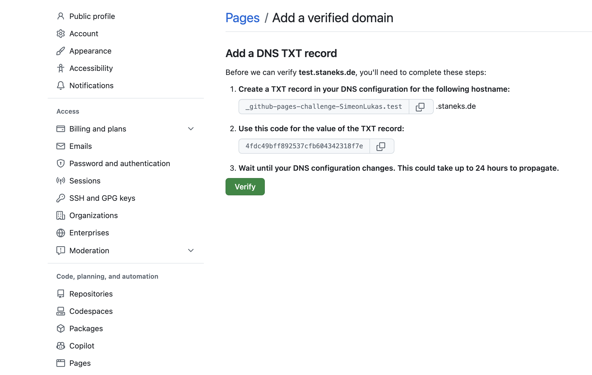

+++
title = "Zola: The Holy Grail of Static Site Generators"
date = 2024-12-16
description = "In this article, I will provide you with a detailed introduction to the Static-Site-Generator (SSG) Zola and the use of Github Pages. We will go through the installation, configuration, and usage of Zola step by step and show you how you can easily host your created pages on Github Pages."
[taxonomies]
tags = ["software", "html", "css", "javascript", "zola", "github-pages", "tutorial"]
[extra]
image = "https://simeon.staneks.de/posts/zola-the-holy-grail-of-ssg/images/zola00001.jpg"
comment =  true
+++

# Genesis

At our weekly jogging meetups, J. and I talk about God and the world, but 90% of our nerd talks are about hosting, programming and all the tech stuff you can imagine. The talks are probably the first reason for jogging and recently J. came up with the great idea that we should both blog. Let's do it! At least one article, once a month. An article about your own blog is a good idea. - Because there are as many ways to blog as there are people.

# Zola - A rusty path

As a bit of a fan of the Rust programming language, I'm always on the lookout for Rust software. Zola is a static site generator that really packs a punch. Here is the website of the software under development: [getzola.org](https://www.getzola.org/)
If you don't shy away from CLI tools, then I recommend giving the software a try.
Of course, there are other alternatives, such as [HUGO](https://gohugo.io/), [Next.js](https://nextjs.org/), [Gatsby](https://www.gatsbyjs.com/), [Astro](https://astro.build/), etc. J. chose Astro in this case, but since I already had good experiences with Zola, I decided to go with it.

## What does Zola do?

Zola creates a so-called static website from static content, from [Tera templates](https://keats.github.io/tera/) and Markdown files. Everything is configured in a so-called `config.toml`, which is located in the root directory of the project or repositories. The generated website can then be found in the `public` directory and can then be provided by any web server (e.g. [Apache](https://httpd.apache.org/), [Caddy](https://caddyserver.com/), [nginx](https://www.nginx.com/), etc.). For my project I use the infrastructure of Github Pages, but more on that later.

## Departure with Zola

Zola is easy to install and use, but also to configure. In this article I will go through the individual steps.

### Installation

There is a suitable binary file for virtually every operating system. On Gihtub you will find the appropriate [release](https://github.com/getzola/zola/releases) in most cases, if you can't find it, you can also find installation scripts and instructions for compiling Zola on [getzola.org](https://www.getzola.org/documentation/getting-started/installation/).

### Initialization

When Zola is installed, you can create the directory structure of a new project with `zola init`.
Zola will then ask you:

```shell
Welcome to Zola!
Please answer a few questions to get started quickly.
Any choices made can be changed by modifying the `config.toml` file later.
> What is the URL of your site? (https://example.com): https://test.staneks.de
> Do you want to enable Sass compilation? [Y/n]: n
> Do you want to enable syntax highlighting? [y/N]: y
> Do you want to build a search index of the content? [y/N]: n

Done! Your site was created in /Users/simeon/zola/testblog.

Get started by moving into the directory and using the built-in server: `zola serve`
Visit https://www.getzola.org for the full documentation.
```

### zola serve

With the command `zola serve` you can now view the website on `localhost:1111`. The page will then adapt to any changes.


### Configuration

The configuration file `config.toml` is located in the root directory of the project. It is the linchpin for the project. All possible configurations can be found in the [documentation](https://www.getzola.org/documentation/getting-started/configuration/).

Depending on the situation, Zola recommends that you create an `ìndex.html` file under `templates`, or you can directly install a theme that already contains templates and possible static content. More detailed instructions can be found under [Installing & using themes](https://www.getzola.org/documentation/themes/installing-and-using-themes/). For my blog, I use the theme [Apollo](https://www.getzola.org/themes/apollo/). This theme already has a dark mode. You can then decide whether to customize the templates in the theme or add more in the `/templates` folder.

#### Theme

After the theme has been installed via git, or the data has been extracted from a .zip archive into the `/themes` directory, the `config.toml` file must be adapted accordingly:

```toml
# The URL of the website
base_url = "https://test.staneks.de"

# Name of the theme that is located in the `/themes/apollo` folder

theme ="apollo"

# Title of the website
title = "Testing"

# Name of the keywords that should be assigned to the articles
taxonomies = [{ name = "tags" }]

# Generate a CSS file from sass
compile_sass = false

# Create a search index
build_search_index = false

#Markdown dependent settings
[markdown]

# Allow syntax highlighting
highlight_code = true

# Theme dependent settings
[extra]

# Activate the Dark mode
theme = "auto"

# Social links
socials = [
 { name = "mastodon", url = "https://indieweb.social/@simerl", icon = "mastodon" },
 { name = "instagram", url = "https://www.instagram.com/simeonstanek/", icon = "instagram" },
 { name = "github", url = "https://github.com/SimeonLukas", icon = "github" },
 { name = "rss", url = "/rss.xml", icon = "rss" },
]

# Navigation bar
menu = [
 { name = "/posts", url = "/posts", weight = 1 },
 { name = "/pages", url = "/pages", weight = 1 },
 { name = "/about", url = "/pages/about", weight = 2 },
 { name = "/tags", url = "/tags", weight = 3 },
]

# Space for variables that are available for the entire website.
```

The website then looks like this:


Depending on how the developer of the theme created his templates, you can find the different .html files under `themes/apollo/templates` that were marked up with the template engine [Tera](https://keats.github.io/tera/).

These templates can then be gradually adapted to your own needs. The syntax can be quickly understood using the documentation and the templates that have already been created. Here are a few examples:

```html
<title>
<!-- If there is a title for a specific page, then use that. -->
 {{ page.title }}
<!-- If there is a title for a specific section, use that. -->
 {{ section.title }}
<!-- If there is no title, use the title of the web page. -->
  {{ config.title }}
 
 </title>
```


```html
<!-- templates/base.html -->
<!DOCTYPE html>
<html lang="en">

<head>
 <meta charset="utf-8">
 <title>Testing</title>
</head>

<body>
 <section class="section">
 <div class="container">
  
 </div>
 </section>
</body>

</html>
```

```html
<!-- templates/index.html -->
<!-- Expand the base template and insert it -->
 

<!-- Contents of the page -->

<h1 class="title">
 This is my blog made with Zola.
</h1>
<!-- Content of the page that is in Markdown below the configuration -->
{{ page.content }}

```

Every .md file that has `template = "index.html"` set in the configuration is rendered as described above.

Thankfully, the zola compiler indicates when keys are missing in the configuration. This means that simple HTML can be written within these templates and the contents of the pages can be adapted using the engine's logic. As with other SSGs, sections are necessary to group individual pages. Section files are located in the source directory of a folder and are marked with an underscore `_index.md`. These sections then have different values ​​and you can iterate through a section over other pages that are also in the folder.

```html
<!-- templates/section.html -->

<main class="list">

<!-- get section -->




<!-- macros can be stored in another template and loaded by importing, they are then available globally -->
{{ post_macros::list_posts(pages=show_pages) }}
</main>

```

### Content
The content is simply stored under `/content`. Simple .md files with a toml configuration in the header, which is marked with three plus signs. Zola then renders these files to html and adds them to the sitemap and, if desired, to the RSS feed and the search index.

```md
+++
title = "Zola"
template = "index.html"
date = 2025-01-01
+++
``` 

After the page has been created and the content has been inserted, it is a matter of making the website public. I would like to give a rough guide here using Github Pages:

## Upload the website to Github Pages

### Add a domain to Github

As a first step, you need to add a domain name in Github Settings. You can see this in the following screenshots:




### Gihtub Pages

1. Create a public repository on Github

2. Create a branch called `gh-pages`

3. Copy the files created by `zola build` in the `public` directory to the `gh-pages` branch or render the page using Github Actions to the `gh-pages` branch

```yaml
# Put this file in `.github/workflows` and name it `zola.yml` or `main.yml`
# Your repository must be public
on: push
name: Build and deploy GH Pages
jobs:
build:
runs-on: ubuntu-latest
if: github.ref == 'refs/heads/main'

steps:
- name: checkout
uses: actions/checkout@v4
- name: build_and_deploy
uses: shalzz/zola-deploy-action@v0.19.2

env:

TOKEN: ${{ secrets.GITHUB_TOKEN }}

```

4. Create a CNAME file in the `gh-pages` directory with the domain of your website. You can save it directly in the `static` folder, then it is always in the right place.

5. Change the A record of your domain to the A record of Github Pages: `185.199.108.153`

6. Adjust your settings on Github as you can see in the following picture:


If everything worked, the website should be visible on your domain.

## Conclusion

Zola is a convincing lightweight, high-performance static site generator that makes optimal use of the advantages of Rust. The combination of easy configuration, powerful Tera templating and seamless GitHub Pages deployment makes it a great choice for developers who value simplicity and control.
The learning curve is moderate - with basic Markdown and HTML knowledge you can quickly build a functional website. The flexibility in themes and templates allows for customization, while the Rust-based architecture ensures speed and reliability.
For anyone looking for a straightforward, fast and customizable static site generator, Zola is definitely worth a closer look.