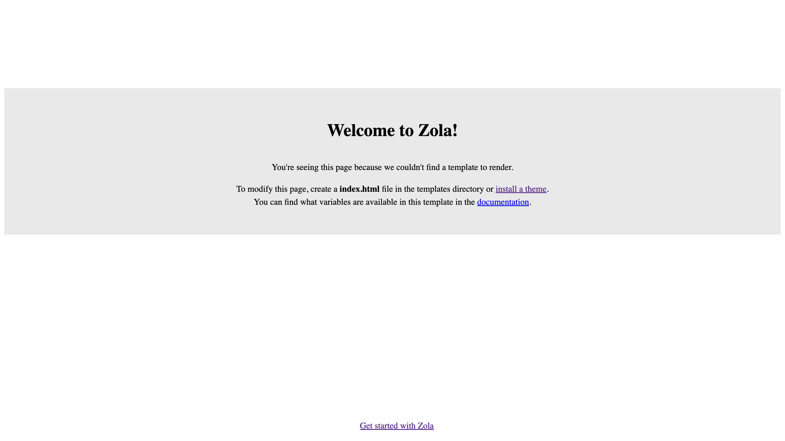
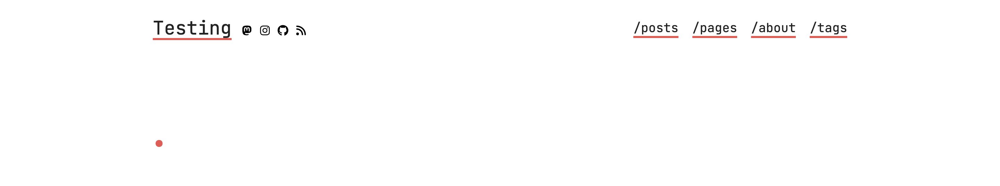

+++
title = "Zola: Der Heilige Gral der Static-Site-Generatoren"
date = 2024-12-16
description = "Eine praktische Einführung in den SSG Zola und Github Pages"
[taxonomies]
tags = ["software", "html", "css", "javascript", "zola" ,"github-pages" ,"tutorial","rust"]
[extra]
image = "https://simeon.staneks.de/posts/20241125/images/zola00001.jpg"
comment =  true
+++

# Genese

Bei unseren wöchentlichen Jogging-Meetups, reden J. und ich über Gott und die Welt, doch 90% unsere Nerd-Talks handeln von Hosting, Programmierung und jeglichem Technikzeugs, das man sich vorstellen kann. Die Talks sind wahrscheinlich auch der erste Grund fürs Joggen und letztens kam J. auf die grandiose Idee, dass wir doch beide bloggen sollten. Let's do it! Mindestens ein Artikel, einmal im Monat. Da bietet sich doch gleich ein Artikel über den eigenen Blog an. - Denn es gibt so viele Wege zum Blog, wie es Menschen gibt.

# Zola - Ein rostiges Wegstück

Als kleiner Fan der Programmiersprache Rust, bin ich grundsätzlich immer auf der Suche nach Rust-Software. Zola ist ein Static-Site-Generator, der es wirklich in sich hat. Hier ist die Website, der in Entwicklung befindlichen Software: [getzola.org](https://www.getzola.org/)
Wenn man nicht vor CLI-Tools zurückschreckt, dann empfehle ich die Software mal zu testen.
Natürlich gibt es weitere Alternativen, wie [HUGO](https://gohugo.io/), [Next.js](https://nextjs.org/), [Gatsby](https://www.gatsbyjs.com/), [Astro](https://astro.build/), etc. J. hat sich in diesem Fall für Astro entschieden, doch da ich schon gute Erfahrungen mit Zola gemacht habe, entschied ich mich dafür.

## Was macht Zola?

Zola erstellt dir aus statischen Inhalten, aus [Tera-Templates](https://keats.github.io/tera/) und Markdown Dateien eine sog. statische Webseite. Konfiguriert wird alles in einer sog. `config.toml`, die im Wurzelverzeichnis des Projekts bzw. Repositories liegt. Die generierte Webseite findet sich dann im `public` Verzeichnis und kann dann von einem beliebigen Webserver (z.B.[Apache](https://httpd.apache.org/), [Caddy](https://caddyserver.com/), [nginx](https://www.nginx.com/), etc.) bereitgestellt werden. Für mein Projekt nutze ich die Infrastruktur von Github Pages, aber dazu später mehr.

## Aufbruch mit Zola

Zola ist einfach zu installieren und zu benutzen, aber auch zu konfigurieren. In diesem Artikel werde ich auf einzelne Schritte eingehen.

### Installation

Es gibt quasi für jedes Betriebssystem eine passende Binärdatei. Auf Gihtub findet man in den meisten Fällen den passenden [Release](https://github.com/getzola/zola/releases), wenn der nicht zu finden ist, dann findet man auch auf [getzola.org](https://www.getzola.org/documentation/getting-started/installation/) Installationsskripte und auch eine Anleitung zum kompilieren von Zola.

### Initialisierung

Wenn Zola installiert ist, kann man mit `zola init` die Verzeichisstruktur eines neuen Projekts erstellen.
Zola frägt dich dann:

```shell
Welcome to Zola!
Please answer a few questions to get started quickly.
Any choices made can be changed by modifying the `config.toml` file later.
> What is the URL of your site? (https://example.com): https://test.staneks.de
> Do you want to enable Sass compilation? [Y/n]: n
> Do you want to enable syntax highlighting? [y/N]: y
> Do you want to build a search index of the content? [y/N]: n

Done! Your site was created in /Users/simeon/zola/testblog.

Get started by moving into the directory and using the built-in server: `zola serve`
Visit https://www.getzola.org for the full documentation.
```

### zola serve

Mit dem Befehl `zola serve` kann man nun die Webseite auf `localhost:1111` einsehen. Bei jeder Änderung passt sich die Seite dann auch an.



### Konfiguration

Die Konfiguartionsdatei `config.toml` liegt im Wurzelverzeichnis des Projekts. Sie ist der Dreh und Angelpunkt für das Projekt. Alle möglichen Konfigurationen finden sich in der [Dokumentation](https://www.getzola.org/documentation/getting-started/configuration/).

Je nach dem empfiehlt dir Zola eine `ìndex.html` datei unter `templates` zu erstellen, bzw. kann man direkt ein Theme installieren, das schon Templates und mögliche statische Inhalte beinhaltet. Eine genauere Anletung dazu gibt es unter [Installing & using themes](https://www.getzola.org/documentation/themes/installing-and-using-themes/). Für meinen Blog gehe ich mit dem Theme [Apollo](https://www.getzola.org/themes/apollo/). Diese Theme bringt schon einen Darkmode mit. Man kann sich dann entscheiden ob man die Templates im Theme anpasst, oder weitere im Ordner `/templates` hinzufügt.

#### Theme

Nachdem das Theme per git installiert wurde, oder die Daten von einem .zip Archiv in das Verzeichnis `/themes` extrahiert wurden, muss man die `config.toml` Datei dem entsprechend anpassen:

```toml
# Die URL der Webseite
base_url = "https://test.staneks.de"

# Name des Themes, das im Ordner `/themes/apollo` liegt
theme ="apollo"

# Title der Webseite
title = "Testing"

# Bezeichnung der Schlagworte, die den Artikeln zugewiesen werden sollen
taxonomies = [{ name = "tags" }]

# Generiere eine CSS Datei aus sass
compile_sass = false

# Erstelle einen Suchindex
build_search_index = false

#Markdown abhängige Einstellungen
[markdown]

# Erlaube Syntax Highlighting
highlight_code = true

# Theme abhängige Einstellungen
[extra]

# Aktiviere das Darkmode
theme = "auto"

# Social links
socials = [
    { name = "mastodon", url = "https://indieweb.social/@simerl", icon = "mastodon" },
    { name = "instagram", url = "https://www.instagram.com/simeonstanek/", icon = "instagram" },
    { name = "github", url = "https://github.com/SimeonLukas", icon = "github" },
    { name = "rss", url = "/rss.xml", icon = "rss" },
]

# Navigationleiste
menu = [
    { name = "/posts", url = "/posts", weight = 1 },
    { name = "/pages", url = "/pages", weight = 1 },
    { name = "/about", url = "/pages/about", weight = 2 },
    { name = "/tags", url = "/tags", weight = 3 },
]

# Platz für Variablen, die für die ganze Webseite zur Verfügung stehen.
```

Danach schaut die Webseite so aus:



Je nachdem wie der Entwickler des Themes seine Templates erstellt hat findet man unter `themes/apollo/templates` die unterschiedlichen .html-Dateien, die mit der Template Engine [Tera](https://keats.github.io/tera/) ausgezeichnet wurden.
Diese Templates können dann nach und nach an die eigenen Bedürfnisse angepasst werden. Anhand der Dokumentaion und der schon erstellten Templates kann die Syntax schnell verstanden werden. Hier ein paar Beispiele:

```html
    <title>
        <!-- Wenn es einen Titel für eine spezifische Seite gibt, dann nimm diese. -->
         {{ page.title }}
        <!-- Wenn es einen Titel fuür eine spezifische Section gibt, dann nimm diese. -->
         {{ section.title }}
        <!-- Wenn es keinen Titel gibt, dann den Titel der Webseite. -->
         {{ config.title }}
        
    </title>
```


```html
<!-- templates/base.html -->
<!DOCTYPE html>
<html lang="en">

<head>
  <meta charset="utf-8">
  <title>Testing</title>
</head>

<body>
  <section class="section">
    <div class="container">
       
    </div>
  </section>
</body>

</html>
```

```html
<!-- templates/index.html -->
<!-- Erweitere das base Template und füge es ein -->
 
<!-- Inhalt der Seite -->

<h1 class="title">
  This is my blog made with Zola.
</h1>
<!-- Inhalt der Seite die im Markdown unterhlab de Konfiguration ist -->
{{ page.content }}

```

Jede .md Datein, bei der in der Konfiguartion `template = "index.html"` gesetzt wurde, wird wie oben beschrieben gerendert.
Der zola Kompiler weißt dankenswerterweise darauf hin, wenn keys in der Konfiguartion fehlen. Somit kann innerhalb dieser Templates einfaches HTML geschrieben werden und es lassen sich mit der Logik der Engine die Inhalte der Seiten anpassen. Sections sind wie bei anderen SSGs auch notwendig um einzelne Seiten zur gruppieren. Section Dateien liegen im Quellverzeichnis eines Ordners und werden mit Unterstrich gekennzeichnet `_index.md`. Diesen Sections liegen dann andere Werte vor und durch eine Section kann man über andere Seiten, die auch in dem Ordner liegen iterieren.

```html
<!-- templates/section.html -->
      
        <main class="list">
            
            <!-- get section -->
                
            
                
            
            <!-- macros können in einem anderen Template hinterlegt werden und durch das importieren geladen werden, diese sind dann global verfügbar -->
            {{ post_macros::list_posts(pages=show_pages) }}
        </main>
    
```

### Inhalt
Der Inhalt wird einfach unter `/content` abgelegt. Einfache .md Dateien mit einer toml Konfiguration im Header, der durch drei Pluszeichen gekennzeichnete wird. Zola rendert diese Dateien dann zu html und fügt sie zugleich der Sitemap hinzu und wenn gewünscht dem RSS Feed und dem Suchindex.

```md
+++
title = "Zola"
template = "index.html"
date = 2025-01-01
+++
``` 

Nachdem die Seite erstellt wurde und der Inhalt eingefügt wurde, geht es darum die Webseite öffentlich zu machen.
Anhand von Github-Pages möchte ich hier eine grobe Anleitung geben:

## Upload der Webseite mit Github Pages

### Add a domain to Github

Zu allererst muss die private Domain bei Github hinzugefügt werden. Die Schritte kann man auf folgenden Screenshots nachsehen:


### Gihtub Pages

1. Erstelle ein öffentliches Repository auf Github

2. Erstelle ein Branch namens `gh-pages`

3. Kopiere die durch `zola build` erstellten Dateien im `public` Verzeichnis in den Branch `gh-pages`  oder rendere die Seite durch Github Actions in den Branch `gh-pages`

```yaml
# Füge diesen Script in `.github/workflows` ein und benenne es in `zola.yml` oder `main.yml`
# Dein Repository muss öffentlich sein
on: push
name: Build and deploy GH Pages
jobs:
  build:
    runs-on: ubuntu-latest
    if: github.ref == 'refs/heads/main'
    steps:
      - name: checkout
        uses: actions/checkout@v4
      - name: build_and_deploy
        uses: shalzz/zola-deploy-action@v0.19.2
        env:
          TOKEN: ${{ secrets.GITHUB_TOKEN }}
```

4. Erstelle eine CNAME Datei in das Verzeichnis `gh-pages` mit der Domain deiner Webseite. Du kannst sie direkt im Ordner `static` ablegen, dann ist sie immer an der richtigen Stelle.

5. Ändere den A Record deiner Domain auf den A-Record von Github Pages: `185.199.108.153`

6. Passe deine Einstellungen auf Github an, wie du es auf dem folgenden Bild siehst:


Wenn das alles funktioniert hat, dürfte die Webseite auf deiner Domain sichtbar sein.

## Fazit

Zola überzeugt als leichtgewichtiger, performanter Static-Site-Generator, der die Vorzüge von Rust optimal nutzt. Die Kombination aus einfacher Konfiguration, mächtigem Tera-Templating und nahtlosem GitHub-Pages-Deployment macht ihn zu einer hervorragenden Wahl für Entwickler, die Wert auf Einfachheit und Kontrolle legen.
Die Lernkurve ist moderat - mit grundlegenden Markdown- und HTML-Kenntnissen kann man schnell eine funktionale Website aufbauen. Die Flexibilität bei Themes und Templates erlaubt eine individuelle Gestaltung, während die Rust-basierte Architektur für Geschwindigkeit und Zuverlässigkeit bürgt.
Für alle, die einen unkomplizierten, schnellen und anpassungsfähigen Static-Site-Generator suchen, ist Zola definitiv einen genaueren Blick wert.
